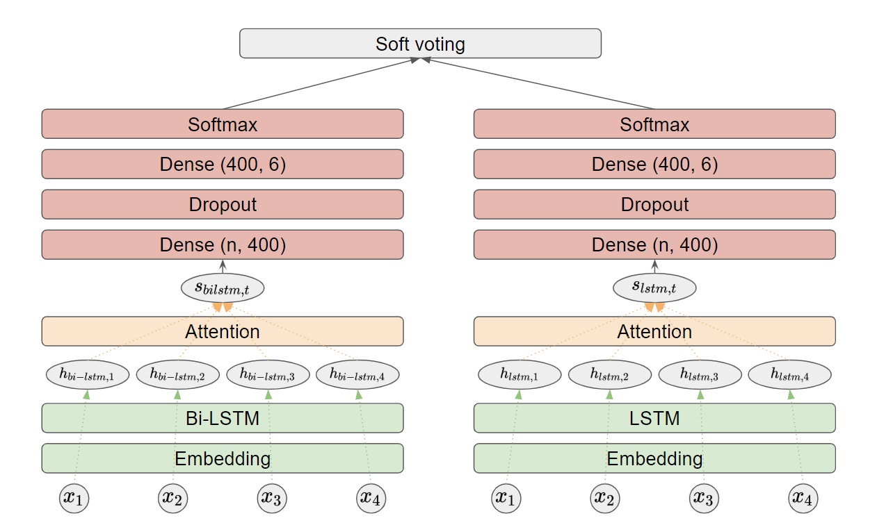

# BiLSTM with Attention

[논문]( https://www.aclweb.org/anthology/W18-6226/ )

## Index

1. BiLSTM with Attention
   1. Embedding Layer
   2. RNN Cell Layer
   3. Attention Layer
   4. Dense Layers

## BiLSTM with Attention

위 논문은 Classification 문제를 해결하기 위해 LSTM-Attention 모델과 BiLSTM-Attention 모델을 사용한 논문이다. 구조를 살펴보면 다음과 같다.

1. 문장의 단어들을 embedding 한다.
2. embedding된 벡터들을 RNN Cell(BiLSTM 혹은 LSTM)에 넣는다.
3. RNN Cell의 출력값들을 attention layer에 넣고 취합하여 하나의 벡터를 만든다.
4. Dense-Dropout-Dense-Softmax layer에 차례로 입력한다.
5. Bi-LSTM에서 나온 확률 분포와 LSTM에서 나온 확률 분포를 soft voting한다.

이 구조에 들어가 있는 layer들을 하나 씩 살펴보자.

### Embedding Layer

이 논문에서 Embedding matrix는 twitter를 통해 학습된 word2vec의 projection matrix를 사용한다. Embedding vector의 dimension은 400이다.

### RNN Cell Layer

RNN Cell layer는 뉴런의 개수는 400이 LSTM과 BiLSTM을 사용하고 벡터 $h$를 출력한다. BiLSTM의 출력 벡터 $h$는 앞에서 뒤로 보내는 LSTM의 출력 벡터 $h_f$와 뒤에서 앞으로 보내는 LSTM의 출력 벡터 $h_b$를 concat하여 $h$를 만든다. 이를 통해 특정 time step에서 과거와 미래의 input feature들을 모두 참조할 수 있다.

### Attention Layer

[참조 논문]( http://ceur-ws.org/Vol-2086/AICS2017_paper_10.pdf )

[참조 블로그](https://lovit.github.io/machine%20learning/2019/03/17/attention_in_nlp/ )

Attention layer를 통해 각각의 단어가 tweet의 감정에 얼마나 영향을 끼치는지 파악하고 이를 축약할 수 있다. t번째 tweet sentence의 i번째 word는 RNN Cell을 통해 $h_{ti}$로 변환되고 이는 먼저 MLP를 지나고 $tanh$ 활성화 함수를 거쳐 $u_{ti}$로 변환된다.

- $u_{ti} = tanh(Wh_{ti} + b)$

여기서 $W$는 MLP의 weight matrix이고 $b$는 MLP의 bias vector다.

- $\alpha_{ti} = \frac{exp(u^T_{ti} u_w)}{\sum^n_{j=1}exp(u^T_{tj} u_w)}$

여기서 $u_w$는 문장의 뜻이 함축ㅋ적으로 담아내게 학습되는 벡터이고 $\alpha_{ti}$는 $u_{ti}$가 $u_w$와 같은 방향일수록 높게 측정된다.

- $s_t = \sum_i \alpha_{ti}h_{ti}$

$s_t$는 문장을 함축적으로 표현하는 벡터가 되는데, 이 벡터는 $h_{ti}$가 변환되어 $u_{ti}$가 되었을 때 $u_w$와 가장 비슷하면 그 $h_{ti}$를 많이 따라가게 된다.

### Dense Layers