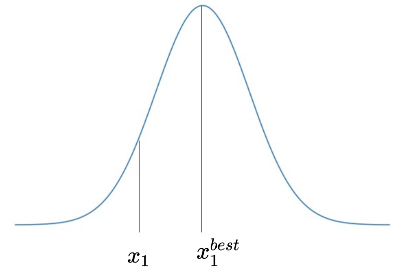
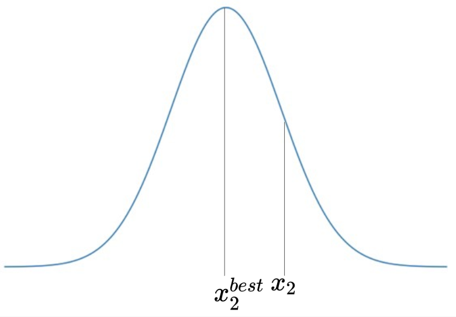
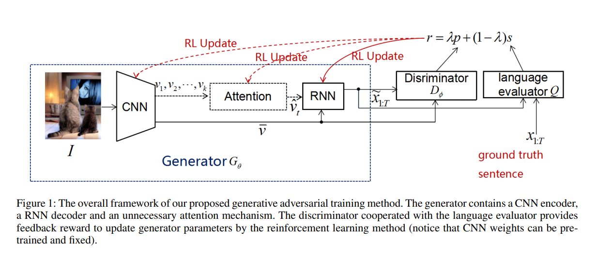
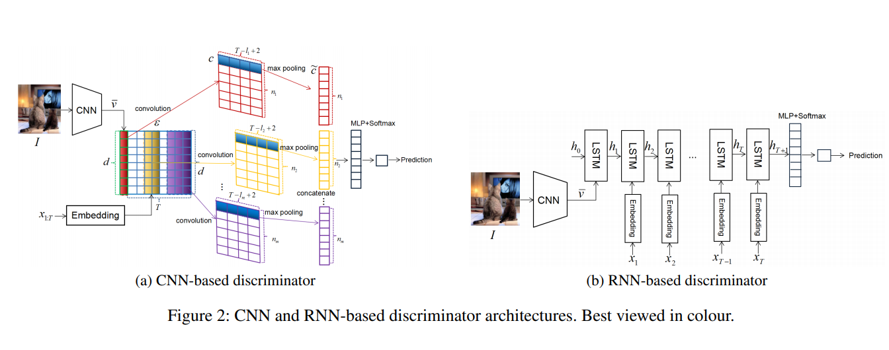

# Improving Image Captioning with Conditional Generative Adversarial Nets

## Index

0. Preliminary
   1. Policy Gradient
1. Introduction
2. Image Captioning Via Reinforcement Learning
3. Proposed Conditional Generative Adversarial Training Method
   1. Overall Framework
   2. CNN-based Discriminator Model
   3. RNN-based Discriminator Model
   4. Discriminator's Obejective Function
   5. Algorithm

## Preliminary

본 논문은 Image Captioning에 decoder 파트에서 강화학습을 사용한다. 이를 이해하기 위해서 NLP에서 sentence generation을 할 때에 강화학습이 어떻게 적용되는지 알아보자.

강화학습은 환경 environment, 상태 state, 보상 reward, 전략 policy로 구성되어있고, 최종적인 reward를 최대화하기 위해 적절한 policy를 구하는 것이 목적이다. sentence generation을 하기 위해 RNN을 주로 사용하는데 RNN은 강화학습을 적용하기 좋은 특성을 가지고 있다.

- environment: RNN layer
- state: previous hidden state
- action: next token
- reward: BLUE, CIDEr, SPICE, etc.

이 논문에서 사용하는 목적함수는 다음과 같다.

- $L_G(\theta) = \mathbb{E}_{x^s \sim G_\theta}[r(x^s)]$
  - $G$: caption generator
  - $\theta$: parameters
  - $G_\theta$: caption generator with the parameters $\theta$
  - $x^s$: sentence from the distribution $G_\theta $
  - $r$: language evaluation metric score(CIDEr, BLUE, SPICE, etc.)

목적함수의 값을 가장 크게 하는 최적 parameters를 찾기위해 policy gradient인 REINFORCE 알고리즘을 이용할 것이다. Gradient estimate의 variance를 줄이기 위해 baseline function $b$를 사용한다.

- $\bigtriangledown_\theta L_G(\theta) \approx 
\sum^{T_s}_{t=1}(r(x^s_{1:t}) - b) \bigtriangledown_\theta \operatorname{log} G_\theta(x^s_t|x^s_{1:t-1})
$

Rennie et al. 2017의 SCST(self-critical sequence training) method에 따라 baseline function을 reward $r(x^g)$ (obtained by the current model under the greedy decoding algorithm used at test time)를 사용한다. 즉, 

- $\bigtriangledown_\theta L_G(\theta) = 
\sum^{T_s}_{t=1}(r(x^s) - r(x^g)) \bigtriangledown_\theta \operatorname{log} G_\theta(x^s_t|x^s_{1:t-1})
$  

### Policy Gradient

위에서 구한 목적함수의 gradient를 이용해 REINFORCE 알고리즘이 어떻게 적용되는지 간단한 예를 통해 알아보자.

1. sentence generation 과정

   $t=1$일 때, 주어진 state $S_1$는 (\<sos\>)이다. $S_1$의 $G_\theta$ 값인 discrete probability distribution에서 $x_1$을 추출한다.
   
   $t=2$일 때, 주어진 state $S_2$는 (\<sos>, $x_1$)이다. $S_2$의 $G_\theta$ 값인 discrete probability distribution에서 $x_2$를 추출한다.
   
   만약 $x_2$가 \<eos\> token이라면 주어진 state $S_3$(\<sos\>, $x_1$, $x_2$)를 평가한 reward $r$을 얻고 프로세스가 종료된다.
   
   | T    | S    |     |                                                              |
   | ---- | ---- | ---- | ------------------------------------------------------------ |
   |  $t=1$  |  $S_1: \text{<sos>}$  |  |  |
   |  | S => <br>$G_\theta(A_1=a|\text{<sos>})$ |      |  |
   | $t=2$ | $S_2: \text{<sos>}, x_1$                           |                               |  |
   | | T, S, R => <br>$G_\theta(A_1=a|\text{<sos>}, x_1)$ |  |  |
   | $t=3$ | $S_3: \text{<sos>}, x_1, x_2$ | $R:r(\text{<sos>}, x_1, x_2)$ |  |
   
2. 한 에피소드가 끝난 후, gradient를 이용한 parameters 업데이트하기

   t기의 policy gradient 업데이트 factor는 다음과 같다.

   - $\alpha\{r^t G_t\bigtriangledown_\theta \operatorname{log}\pi_\theta(A_t|S_t)\}$

   본 논문에서는 discount factor $\alpha$가 1이며, return $G_t$를 $r(x^s) - r(x^g)$로 사용한다.

   - $t = 1$

     $\theta \leftarrow \theta + \alpha\{(r(x^s) - r(x^g))\bigtriangledown_\theta \operatorname{log}G_\theta(x_1|\text{<sos>})\}$

     Here, $r$ is the reward function, $\alpha$ is the learning rate, and there is no discount factor.

   - $t = 2$

     $\theta \leftarrow \theta + \alpha\{(r(x^s) - r(x^g))\bigtriangledown_\theta \operatorname{log}G_\theta(x_2|\text{<sos>}, x_1)\}$

   $t=1$과 $t=2$에 $\theta$가 업데이트 된 것을 합치면

   $\theta \leftarrow \theta + \alpha\sum^{2}_{t=1}(r(x^s) - r(x^g)) \bigtriangledown_\theta \operatorname{log} G_\theta(x^s_t|x^s_{0:t-1})$

   즉,

   $\theta \leftarrow \theta + \alpha \bigtriangledown_\theta L_G(\theta)$

   이렇게 업데이트 된다.

## Introduction

이 논문은 reinforcement-learning의 확장으로서 encoder-decoder 구조를 가진 GAN image captioning framework를 제안한다.

기존 연구들은 다양한 automatic metrics에서 높은 점수를 받기위해 하나의 metric이나 이들 몇 개의 조합으로 model들을 최적화해왔다. 하지만 이러한 부분 최적화 방식은 다양한 metric에 대하여 일관된 성능을 보여주지 못한다. 저자들은 모든 language evaluation metrics에 좋은 성과를 향상시키기 위해 "discriminator" network를 고안하게 되었다. 

### Main contributions

- 기존에 있던 RL-based image captioning framework를 확장할 수 있고, 전반적인 evaluation metrics에 대해 높은 성과를 보이는 generic한 알고리즘
- 기존 evaluation metrics을 대체할 수 있는 neural nework를 사용한 Well-trained discriminators

## Image Captioning Via Reinforcement Learning

기존 RNN 모델들은 MLE를 최대화하는 것이 목적이었다.

- $\begin{matrix}
  J_G(\theta) &=&  \frac{1}{N}\sum^N_{j=1}\operatorname{log} G_\theta(x^j|I^j)\\
       &=& \frac{1}{N}\sum^N_{j=1}\sum^{T_j}_{t=1}\operatorname{log} G_\theta(x^j_t|x^j_{1:t-1}, I^j)
  \end{matrix}$ 
  - where $I^j$ is the $j$-th image,
  - $x^j = (x^j_1, x^j_2, \cdots, x^j_{T_j})$ is the ground truth caption of the $j$-th images,
  - $T_j$ is the caption length of the $j$-th image,
  - $N$ is the total number of training examples, and
  - $G_\theta(\cdot)$ is the probability of generated words given an image or previous words, parameterized by $\theta$

만약 RL을 decoder에 사용한다면,

- agent: decoder
- envirionment: input words and image features extracted by the encoder
- policy: caption generator $G_\theta$
- action: prediction of the next word
- state: weights of decoder, attention models, etc.
- reward: language evaluation metric score

라고 해석할 수 있고, RL의 목적함수는

- $L_G(\theta) = \mathbb{E}_{x^s \sim G_\theta}[r(x^s)]$
  - where $x^s = (x^s_1, x^s_2, \cdots, x^s_T)$ is a sample sequence from generator $G_\theta$.

로 정의될 수 있다.

실전적으로는 Monte-Carlo sample로 approximated할 수 있다.

- $L_G(\theta) \thickapprox r(x^s), x^s \sim G_\theta$

$L_G(\theta)$의 gradient는 baseline function $b$을 가지고 있는 REINFORCE policy gradient approach로 계산될 수 있다.

- $\bigtriangledown_\theta L_G(\theta) \thickapprox 
  \sum^{T_s}_{t=1}(r(x^s_{1: t }) - b) \bigtriangledown_\theta \operatorname{log} G_\theta(x^s_t|x^s_{1:t-1})
  $ 

Self-critical sequence training(SCST) method는 baseline function $b$으로 reward $r(x^g)$를 사용한다. $r(x^g)$는 현재 모델이 greedy decoding algorithm을 통해 출력한 sentence $x^g$에 대한 reward $r$의 값이다. 따라서 최종적인 gradient function은 다음과 같이 써진다.

- $\bigtriangledown_\theta L_G(\theta) = 
  \sum^{T_s}_{t=1}(r(x^s) - r(x^g)) \bigtriangledown_\theta \operatorname{log} G_\theta(x^s_t|x^s_{1:t-1})
  $  
  - 여기서 $x^s_{1:T_s}$, $x^g_{1:T}$의 reward는 t에 따라 변하지 않음으로, 편의상 $x^s$와 $x^g$로 표기한다.
  - $r(x^s_{1:t})$와 $r(x^g_{1:t})$를 비교하는 것은 비합리적이다.
    - 두 seqence 모두 완전하지 않은 문장이기 때문에, reward가 낮다.


## Proposed Conditional Generative Adversarial Training Method

### Overall Framework



위 그림은 논문에서 소개하는 모델에 전반적인 framework이다.

#### Generator

미리 훈련된 CNN layer를 통해 (weights can be fixed) 이미지의 feature들을 추출하고 attention layer(unnecessary)를 통해 각 feature의 상관관계를 파악하고, RNN layer를 이용해 sequence $\tilde{x}_{1:T}$를 출력한다.

#### Discriminator

CNN layer나 RNN layer로 구성된 discriminator는 input으로 들어온 문장이 human generated sentence일 확률을 출력한다.

마지막으로 BLUE, CIDEr 등의 language metrics를 통해 sentence를 평가하여 reward function $r$을 구한다.

- $r(\tilde{x}|I, x) = \lambda \cdot p + (1 - \lambda)\cdot s = \lambda\cdot D_\phi(\tilde{x}|I) + (1 - \lambda)\cdot Q(\tilde{x}|x)$
  - where $\tilde{x}$: full sentence given image $I$
  - $x$: ground truth sentence
  - $\lambda$: hyper-parameter between 0 and 1

다음 두 섹션은 CNN-based discriminator model과 RNN-based discriminator model을 소개한다.


### CNN-based Discriminator Model



CNN-based discriminator의 구조는 위 그림의 왼쪽과 같다.

1. 먼저 CNN layer에 들어가기 위한 feature map을 다음과 같이 만든다.

   $\epsilon = \bar{v} \oplus (E\cdot x_1) \oplus (E\cdot x_2) \oplus \cdots \oplus (E\cdot x_T)$

   - where $\bar{v} = CNN(I)$ is the $d$-dimenstional image fueature preprocessed by a CNN for input image $I$,
   - $E \in \mathbb{R}^{d \times U}$ is the embedding matrix to map a $U$-dimensional one-hot word vector $x_i$ ($i = \{1, 2,\cdots, T\}$) into a $d$-dimensional token embedding,
   - $\oplus$ is the horizontal concatenation operation to build the matrix $\epsilon  \in \mathbb{R}^{d \times (T+1)}$

2. different window size $d \times l_i (i = \{1, 2, \cdots, m\})$를 이용해 $m$개의 convolution kernel group을 생성한다. 각 group은 $n_i$ ($i = \{1, 2, \cdots, m\}$)개의 feature maps로 이루어져있다.

   concatenated feature map $\epsilon$에 적용되는 한 kernel($\in \mathbb{R}^{d \times l}$)은 feature map $c$($= [c_1, c_2, \cdots, c_{T-l+2}]$)을 생성한다.

   $c_i = ReLU(w * \epsilon_{i:i+l-1} + b)$ 

   - where $i = \{1, 2, \cdots, T-l+2\}$,
   - $*$ is the convolution operation,
   - $b$ is  a bias term
   - $ReLU(\cdot)$ is the Rectified Linear Unit.

3. Max-over-time pooling operation을 적용하고 모든 pooled feature들을 concatenate한다.

   $\tilde{c} = \operatorname{concatenation}_{k \in kernels}(max\{c^k\}) $

   - where $\tilde{c} \in \mathbb{R}^n$ ($n = \sum^m_{i=1} n_i$)

4. High way architecture을 적용한다.

   $\tau = \sigma(W_T \cdot \tilde{c} + b_ T)$

   $H = ReLU(W_H \cdots \tilde{c} + b_H)$

   $\tilde{C} = \tau \odot H + (1 - \tau) \odot \tilde{c}$,

   - where $W_T, W_H \in \mathbb{R}^{n \times n}$ and $b_T, b_H \in \mathbb{R} ^ n$ are high way layer weights and bias, respectively,
   - $\sigma$ is the sigmoid function,
   - $\odot$ is the piece-wise multiplication operation.
   
5. 마지막으로 fully connected layer와 sigmoid transformation을 $\tilde{C}$에 적용하여 given sentence가 human generated sentence일 확률을 출력한다.

   $p = \sigma(W_o \cdot \tilde{C} + b_o)$,

   - where $W_0 \in \mathbb{R} ^ {2 \times n}$ and $b_o \in \mathbb{R}^2$ are output layer weights and bias, respectively.

   Q. 왜 $\mathbb{R}^{2\times n}$일까?

### RNN-based Discriminator Model


RNN-based discriminator의 구조는 위 그림의 오른쪽과 같다.

1. Image feature vector $\bar{v}$와 randomly initialized hidden state $h_0 \in \mathbb{R}^d$를 LSTM에 넣는다.

2. 그 다음 스탭부터는 token embeddings를 LSTM에 넣는다.

   $h_{t+1}=
\begin{cases}
LSTM, & t=0 \\
3n+1, & t = 1, 2, \cdots, T
\end{cases}$

3. 마지막으로 fully connected layer와 softmax layer를 지나 출력된 sentence가 human generated sentence일 확률을 출력한다.

   $p = \sigma(W_R \cdot h_{T+1} + b_R)$,

   - where $W_0 \in \mathbb{R} ^ {2 \times n}$ and $b_o \in \mathbb{R}^2$ are output layer weights and bias, respectively.

### Discriminator's Obejective Function

Discriminator의 parameters $\phi$는 다음의 함수를 최대화하게 학습된다.

$\begin{matrix}
L_D(\phi) &=&  \mathbb{E}_{I, x_{1:T} \in \mathbb{S}_r}[\operatorname{log}D_\phi(I, x_{1:T})] \\
     &+& 0.5 \cdot \mathbb{E}_{I, \tilde{x}_{1:T} \in \mathbb{S}_f}[\operatorname{log}(1- D_\phi(I, x_{1:T}))]\\
     &+& 0.5 \cdot \mathbb{E}_{I, \hat{x}_{1:T} \in \mathbb{S}_w}[\operatorname{log}(1 -D_\phi(I, x_{1:T}))]\\
\end{matrix}$ 

- where $\mathbb{S}_r$: real pairs $(I, x_{1:T})$
- $\mathbb{S}_f$: fake pairs $(I, \tilde{x}_{1:T})$
- $\mathbb{S}_w$: wrong pairs $(I, \hat{x}_{1:T})$

### Algorithm

```
Algorithm 1. Image Captioning Via Generative Adversarial Training Method

Require: caption generator G_theta; discriminator D_phi; language evaluator Q, e.g. CIDEr-D; training set S_r = {(I, x_1:T)} and S_w = {(I, hat_x_1:T)}

Ensure: optimal parameters theta, phi
	1: Initial G_theta and D_phi randomly.
	2: Pre-train G_theta on S_r by MLE.
	3: Generate some fake samples based on G_theta to form S_f = {(I, tilde_x_1:T)}.
	4: Pre-train D_phi on the union of S_R, S_f and S_w.
	5: repeat
	6: 	for g-steps=1 : g do
	7: 		Generate a mini-batch of image-sentence pairs {(I, tilde_x_1:T)} by G_theta.
	8: 		Calculate p.
	9: 		Calculate s based on Q.
	10: 	Calculate reward r.
	11: 	Update generator parameters theta by SCST method.
	12:  end for
	13:  for d-steps=1 : d do
	14: 	Generate negative image-sentence pairs {(I, tilde_x_1:T)} by G_theta, together with negative samples {(I, hat_x_1:T)} in S_w and positive samples {(I, x_1:T)} in S_r.
	15: 	Update discriminator parameters phi.
	16:  end for
	17: until generator and discriminator converge.
```

