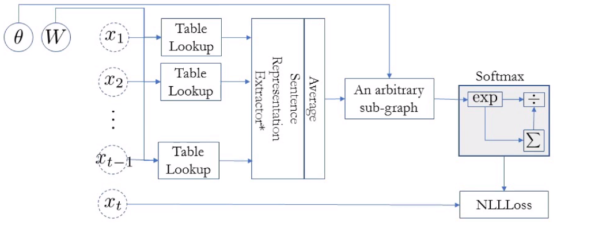
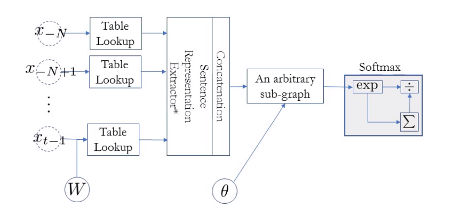

# Neural Language Models, 강의 내용

## Index

1. Overview: Language Modelling
2. Autoregressive Language Modelling
3. N-Gram Language Models
4. Neural N-Gram Language Model
5. Long Term Dependency
6. Summary

## Overview: Language Modelling

- Input: a sentence
- Output: the probability of the input sentence
- A language model captures the distribution over all posible sentences.
  - $P(X) = p((x_1, x_2, \cdots, x_T))$
- Unlike text classification, it is unsupervised learning.
  - We will however turn the problem into a sequence of supervised learning

Scoring하는 fucntion과 Language generation하는 function은 equivalent하다.

## Autoregressive Language Modelling

- Autoregressive sequence modelling
  - The distribution over the next token is based on all the previous tokens.
    - $P(X) = p(x_1)p(x_2|x_1) \cdots p(x_T|x_1, \cdots, x_{T-1})$
  - This equality holds exactly due to the def. of conditional distribution
- Unsupervised learning becomes a set of supervised problems.
  - Each conditional is a neural network classifier.
  - Input is all the previous tokens (a partial sentence).
  - Output is the distribution over all possible next tokens (classes).
  - It is a **text classification** problem

Language modelling은 원래는 output의 개념이 없이 input sentence가 얼마나 likely한지 판단하는 unsupervised learning이지만 conditinoal distribution을 이용하면 supervised learning으로 문제(previous token들로 next token을 예측하는 문제)로 변환할 수 있다.

- Autoregressive sequence modelling $p(x) = \prod^T_{t=1} p(x_t|x_{<t})$
- Loss function: the sum of negative log-probabilities
  - $\operatorname{log} p_{\theta}(X) = \sum^{N}_{n=1}\sum^{T}_{t=1} \operatorname{log}p_{\theta} (x_t|x_{<t})$

### Scoring a sentence

- A natural way to score a sentence:

  - In Korea, more than half of residents speak Korean.

  - "In" is a reasonable token to start a sentence.

  - "Korea" is pretty likely given "In".

  - "more" is okay token to follow "In Korea"

  - "than" is very likely after "In Korea, more"

  - "half" is also very likely after "In Korea, more than"

    ...

- Sum all these scores and get the sentence score.

## N-Gram Language Model

Neural network가 유행하기 전에는 어떻게 scoring sentence를 했을까?

- We need to estimate n-gram probabilities: $p(x|x_{-N}, x_{-N+1}, \cdots, x_{-1})$

- Recall the def. of conditional and marginal probabilities:

  - $p(x|x_{-N}, x_{-N+1}, \cdots, x_{-1}) = \frac{p(x_{-N}, x_{-N+1}, \cdots, x_{-1}, x)}{\sum_{w\in V}p(x_{-N}, x_{-N+1}, \cdots, x_{-1}, w)}$
    - V: all possible tokens (=vocabulary)

- How do we estimate the probability?

  - I want to estimate the probability of my distorted coin landing head.

  - Maximum likelihood estimation (MLE):

    toss the coin a lot and look at how often it lands heads.

- Data: all the documents or sentences you can collect

  - e.g., Wikipedia, news articles, tweets, ...

- Estimation:

  1. Count the # of occurrences for the n-gram $(x_{-N}, x_{-N+1}, \cdots, x_{-1}, x)$
  2. Count the #'s of occurrences for all the n-grams of the form: $(x_{-N}, x_{-N+1}, \cdots, x_{-1}, ?)$

  - $p(x|x_{-N}, x_{-N+1}, \cdots, x_{-1}) \simeq \frac{c(x_{-N}, x_{-N+1}, \cdots, x_{-1}, x)}{\sum_{w\in V}c(x_{-N}, x_{-N+1}, \cdots, x_{-1}, w)}$

- How likely is "University" given "New York"?

  - Count all "New York University"
  - Count all "New York ?": e.g., "New York State", "New York City", "New York Fire", "New York Police", "New York Bridges", ...
  - How often  "New York University" happens among these?

### N-Gram Language Model - Two problems

1. Data sparsity: lack of generalization

   - What happens "one" n-grams never happens?

     $p(\text{a lion is chasing a llama}) = p(a) \times p(lion|a) \times p(is|\text{a lion}) \times \cdots \times p(llama|\text{chasing a}) = 0 $

     $\text{ since } p(llama|\text{chasing a}) = 0$

2. Inability to capture long-term dependencies

   1. Each coditional only considers a small window of size $n$.
   2. Consider *"the same stump which had impaled the car of many a guest in the past thirty years and which **be refused to have** removed"*
   3. It is impossible to tell "removed" is likely by looking at the four preceding tokens.

long-term dependencies를 해결하려면 window size를 높여야하는데 window size가 높아지면 data sparsity가 증가한다.

해결방안

1. Data sparsity
   - Smoothing: add a small constant to avoid 0.
     - $p(x|x_{-N}, x_{-N+1}, \cdots, x_{-1}) \simeq \frac{c(x_{-N}, x_{-N+1}, \cdots, x_{-1}, x) + \epsilon }{\epsilon|V| + \sum_{w\in V}c(x_{-N}, x_{-N+1}, \cdots, x_{-1}, w)}$
   - Back off: try a shorter window.
     - $c(x_{-N}, \cdots, x) = \begin{cases}
\alpha c(x_{-N+1}, \cdots, x) + \beta, & \mbox{if }c(x_{-N}, \cdots, x) = 0 \\
c(x_{-N}, \cdots, x), & \mbox{otherwise }
\end{cases}$
     - The most widely used approach: Kneser-Ney smoothing/backoff
     - **KenLM** implements the efficient n-gram LM model
   
   KenLM으로 data sparsity는 어느정도 해결할 수 있다.
   
2. Long-Term Dependency

   - Increase $n$: not feasible as the data sparsity worsens.
   - \# of all possible $n$-grams grows exponentially w.r.t. $n: O(|V|^n)$
   - The data size does not grow exponentially: many never-occurring $n$-grams.

- These two problems are closely related and cannot be tackled well.
  - To capture long-term dependencies, $n$ must be large.
  - To address data sparity, $n$ must be small.
  - Conflicting goals.

## Neural N-Gram Language Model

- Neural N-gram Language Model[bengio et al. 2001]: The first extension of n-gram language models using a neural network

  

- Trained using backpropagation and SGD: see Lecture 1

- Generalizes to an unseen n-gram

- Addresses the issue of data sparsity
  - How?
  - Why does the data sparsity happen?
  - A "shallow" answer: some n-grams do not occur in the training data, while they do in the test time.
  - A "slightly deeper" answer: it is difficult to impose token/phrase similarities in the discrete space
    - We need the continuous space using neural networks
  
- In practice,
  1. Collect all n-grams from the corpus.
  2. Shuffle all the n-grams to build a training set
  3. Train the neural n-gram language model using stochastic gradient descent on minibatches containing 100-1000 n-grams.
  4. Early-stop based on the validation set.
  5. Report perplexity on the test set.
     - $ppl = b^{\frac{1}{|D|}\sum_{(x_1, \cdots, x_N) \in D}\operatorname{log}_bp(x_N|x_1, \cdots, x_{N-1})}$
     - ppl의 의미: context를 봤을 때, 그 다음 단어를 얼마나 작은 subset 안에서 고를 수 있는지를 알려줌
     - perplexity가 1이면 다음에 나올 단어가 무엇인지 완벽하게 안다는 것
     - perplexity가 10이면 다음에 나올 단어가 10개 내외에서 무엇인지 안다는 것

## Long Term Dependency

Neural N-Gram Language Model이 data spasity문제는 해결해주지만 long term dependency문제는 해결해주지 못한다.

- n이 커지면 parameter가 늘어나고 늘어난 parameter가 제대로 학습되려면 data가 많아져야한다. 

### Solution1, Increasing the context size - Convolutional Language Models

- Dilated convolution to rapidly increase the window size

  

  출처:  https://towardsdatascience.com/review-dilated-convolution-semantic-segmentation-9d5a5bd768f5 

  - Exponential-growth of the window by introducing, a multiplicative factor
  - By carefully selecting the multiplicative factor, no loss in the information

- Causal convolution: the future tokens cannot be used.

  - Computation as usual: efficiency
  - Clever masking of future tokens: causality

- Efficient computation + larger context

### Causal sentence representation and language modelling

- Any sentence representation learning method from Lecture 2 could be used as long as it does not break the generative story
- In addition to the feedforward and convolutional n-gram language models, we can use any of the remaining sentence representation.

### Infinite context - CBoW Language Models

- Equivalent to the neural LM after replacing "concat" with "average"
  - "Averaging" allows the model to consider the infinite large context window.
- Extremely efficient, but a weak language model
  - Ignores the order of the tokens in the context windows.
    - Any language with a fixed order cannot be modelled well.
  - Averaging ignores the absolute counts, which may be important;
    - If the context window is larger, "verb" becomes less likely in SVO languages.

### Infinite context - Recurrent Language Models [Mikolov et al., 2010]

- A recurrent network summarizes all the tokens so far.
- Use the recurrent network's memory to predict the next token.
- Efficient online processing of a stream text:
  - Constant time per step.
  - Constant memory throughout forward computation
- Useful in practice:
  - Useful for autocomplete and keyword suggestion.
  - Scoring partial hypotheses in generation.
- The recurrent network solves a difficult problem: compress the entire context into a fixed-size memory vector.
- Self-attention does not require such compression but still can capture long-term dependencies.
- Combine these two: a recurrent memory network 

## Summary

### In this lecture, we learned

- What autoregressive language modelling is:

  $p(X) = p(x_1)p(x_2|x_1)\cdots p(x_T|x_1, \cdots, x_{T-1})$

- How auto regressive language modelling transforms unsupervised learning into a series of supervised learning:

  - It is a series of predicting the next token given previous tokens.

- How neural language modelling improves upon n-gram language models:

  - Continuous vector space facilitates generalization to unseen n-grams.
  - Infinitely large context window

- How sentence representation extraction is used for language modelling:

  - Convolutional language models, recurrent language models, and self-attention language models.

