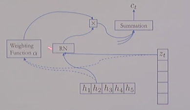
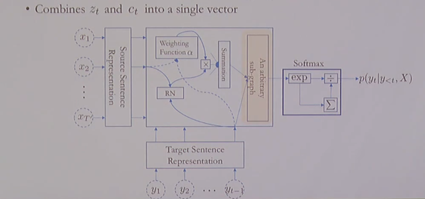

# Neural Machine Translation, 강의 내용 정리

## Index

1. Overview: a bit of history remark
2. Encoder & Decoder
3. RNN Neural Machine Translation
4. Summary

## Overview: a bit of history remark

### Machine Translation

기계 번역: input으로 source language로 쓰여진 문장이 들어오고, output으로 그에 해당하는 target language로 쓰여진 문장이 출력되는 것

Problem statement는 다음과 같다.

- input 문장에 대해 이에 대한 번역 문장을 출력하는 supervised learning이며,

- 주어진 input에 대해 가능한 모든 조건부 확률을 계산한다.

  $p(Y = (y_1, \cdots, y_T)| X = (x_1, \cdots, x_{T'}))$

## Encoder & Decoder

### Token Representation - One-hot Vectors

먼저 source lanugage token과 target language token의 단어 사전을 만들어야한다. Source language와 target lanugage에 대해 tokenize를 하고 subworkd segemtation 후에 index를 지정한다. 그 후에 문장들을 subword token에 대응하는 one-hot vector로 바꿔준다.

### Encoder - Source Sentence Representation

Encoder는 source sentence를 sentence representation vector들로 encoding하면 된다.

- encoded vector들의 개수는 source sentence length와 비례한다.

  $H = (h_1, \cdots, h_{T'})$

- Recurrent network가 주로 쓰이며 CNN과 self-attention의 사용횟수도 점점 늘어가는 추세이다.

(예전과 달리) Encoder는 sentence representation을 하나의 vector로 하지 않는다. 그 이유는 하나의 vector로 encoding하면 information loss가 발생하기 때문이다. sentence의 길이가 매우 길다면 이에 대한 정보를 하나의 vector로 압축하기 힘들 것이고 이에 따라 긴 문장은 모델이 정확하게 번역하기 어려워질 것이다.

### Decoder - Language Modelling

Decoder는 autoregressive language modelling을 이용해 encoder의 출력 vector들을 해석한다. Decoder는 긴 문장에서도 coherent를 잃지 않아야하며, causal structure를 따라야한다.

Conditional language modelling을 적용해야한다.

​	$p(Y|X) = \prod^T_{t=1}p(y_t | y_{<t}, X)$

이를 종합적인 그림으로 보면 다음과 같다.

## RNN Neural Machine Translation

RNN을 이용한 기계번역은 다음과 같이 진행된다.

1. Source sentence representation

   - Encoder에서 bidirectional RNN을 이용하여 각 위치에 context 내용을 반영한 vector를 출력한다.

2. Target prefix representation

   - 현재를 $t$ step이라고 할 때, $y_t$의 representation은 다음과 같이 표현된다.

     $z_t = RNN_{decoder}(z_{t-1}, y_{t-1})$

3. Attention mechanism

   - $z_t$와 source sentence의 어떤 부분이 next target token을 예측하는데 관계가 있을까를 판단할 때는 attention을 사용한다.

     

4. source context vector와 target prefix vector를 이용해 하나의 vector를 출력한다.

   

- Conceptual process
  1. Encode: source sentence를 모두 읽고 무엇을 번역할지 판단한다.
  2. Attention: 각 각의 step에서 무슨 source token(s)이 다음 translated token과 관계가 있는지 결정한다.
  3. Decode: 지금까지 번역된 token들과 attention의 출력값을 이용하여 next token을 예측한다.
  4. \<end-of-sentence> token이 나오기 전까지 2-3을 반복한다.

Attention mechanism의 효과는 다음과 같다.

- source token과 target token 사이의 의미적 매칭을 잘한다.
- long-range reordering 혹은 long-range dependencies를 잘 잡아낸다.

## Summary

이 챕터에서는 다음과 같은 것을 배웠다.

- machine translation이란 source language의 하나의 문장을 target lanugaue의 문장에 mapping하는 것이다.
- Neural machine translation이란 하나의 neural entwork가 번역 과정 전부를 계략적으로 파악하는데 사용되는 것이다.
- RNN neural machine translation system은 다음과 같이 구성된다.
  - Encoder: a bidirectional RNN
  - Decoder: a unidirectional RNN coupled with the attention mechanism

