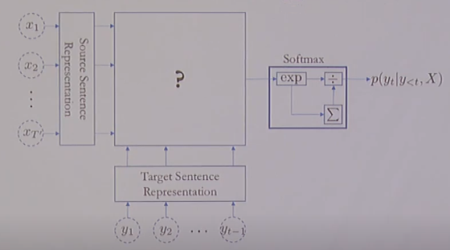
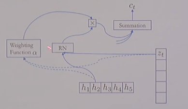
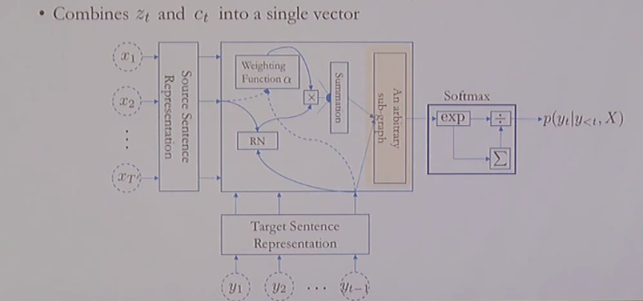
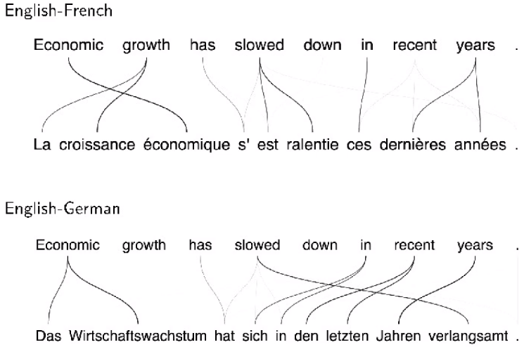

# Neural Machine Translation, 강의 내용

## Index

1. Overview: a bit of history remark
2. Encoder & Decoder
3. RNN Neural Machine Translation
4. Summary

## Overview: a bit of history remark

### Machine Translation

- Input: a sentence written in a source language $L_S$

- Output: a corresponding sentence in a target language $L_T$

- Problem statement:

  - Supervised learnings: given the input sentence, output its translation

  - Compute the conditional distribution over all possible translation given the input 

    $p(Y = (y_1, \cdots, y_T)| X = (x_1, \cdots, x_{T'}))$

## Encoder & Decoder

### Token Representation - One-hot Vectors

1. Build source and target vocabularies of unique tokens
   - For each of source and target languages,
     1. Tokenize: separate punctuations, normalize punctuations, ...
     2. Subword segmentation: segment each token into a sequece of subwords
     3. Collect all unique subwords, sort them by their frequencies (descending) and assign indices.
2. Transform each subword token into a corresponding one-hot vector.

### Encoder - Source Sentence Representation

- Encode the source sentence into a set of sentence representation vectors.

  - \# of encoded vectors is proportional to the source sentence length: often same.

    $H = (h_1, \cdots, h_{T'})$

  - Recurrent networks have been widely used, but CNN and self-attention are used increasingly more often.

- We do not want to collapse them into a single vector.

  - Collapsing often corresponds to information loss.
  - Increasingly more difficult to encode the entire source sentence into a single vector, as the sentence lenght increases
  - When collapsed, the system fails to translate a long sentence correctly.
  - The system translates reasonable up to a certain point, but starts drifting away.
  - We didn't know initially until [Bahdanau et al., 2015]

### Decoder - Language Modelling

- Autoregressive Language modelling with an infinite context

  - Larger context is necessary to generate a coherent sentence.
    - Semantics could be largely provided by the source sentence, but syntactic properties need to be handled by the language model directly.
  - Recurrent networks, self-attention and (dilated) convolutional networks
    - Causal structure must be followed

- Conditional Language modelling

  - The context based on which the next token is predicted is two-fold

    $p(Y|X) = \prod^T_{t=1}p(y_t | y_{<t}, X)$

 

## RNN Neural Machine Translation

1. Source sentence representation

   - A stack of bidirectional RNN
   - The extracted vector at each location is a context-dependent vector representation.

2. Target prefix representation

   - A unidirectional recurrent network

   - Compression of the target prefix

     $z_t = RNN_{decoder}(z_{t-1}, y_{t-1})$

   - Summarizes what has been translated so far.

3. Attention mechanism

   - Which part of the source sentence is relevant for predicting the next target token? Attention

     

4. Fuse the source context vector and target prefix vector

   - Combines $z_t$ and $c_t$ into a single vector.

     

- Conceptual process
  1. Encode: read the entire source sentence to know what to translate.
  2. Attention: at each step, decide which source token(s) to translate next
  3. Decode: based on what has been translated and what need to be translated, predict the next target token.
  4. Repeat 2-3 until the \<end-of-sentence\> special token is generated.

- Sensible alignment between source and target tokens

- Capture long-range reordering/dependencies

- Without strong supervision on the alignment

  - Weakly supervised learning

  

## Summary

### In this lecture, we've learned

- What machine translation is:
  - It maps a sentence in a source language into its translation in a target language.
- What neural machine translation is:
  - A single neural network is used to approximate the entire translation process.
- How to build an RNN neural machine translation system:
  - Encoder: a bidirectional RNN
  - Decoder: a unidirectional RNN coupled with the attention mechanism