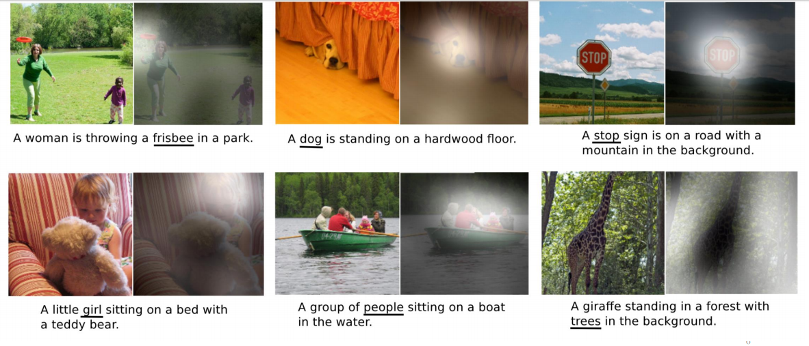
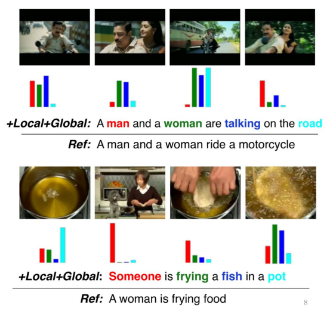
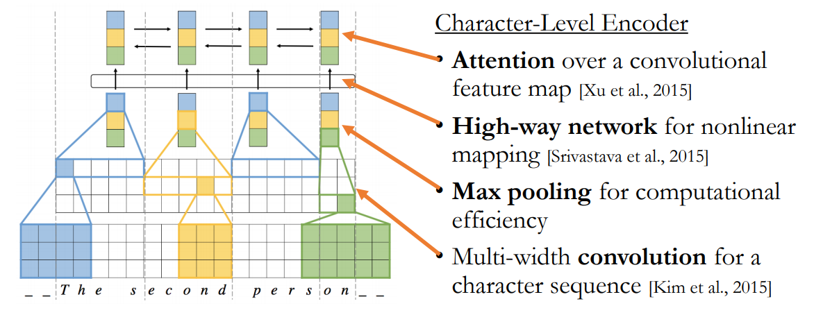
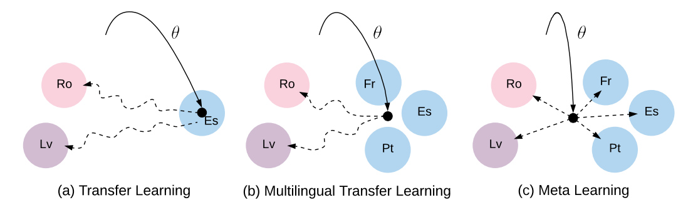
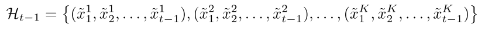
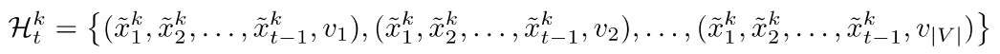

# Case Study

## Index

1. Learning to Describe Multimedia
2. Fully Character-Level Machine Translation
3. Meta-Learning of Low-Resource Neural Machine Translation
4. Real-Time Translation Learning to Decode

## Learning to Describe Multimedia

### Description Generation

Machine Translation은 다른 "mode"(ex. image, video, etc. ...) 즉, multimedia content가 주어졌을 때,  그 content를 설명해 주는 것도 가능하다.

key idea: input에 입력되는 것이 굳이 sentence일 필요가 있을까? 이미지, 비디오, speech가 들어오더라도 continuous vector 바꾸기만 하면 machine translation 구조를 사용할 수 있을 것이다.

### Image Caption Generation

Convolution neural network을 이용하여 주어진 이미지의 representation continuous vector를 구하게 되면 이를 decoder에 넣어 해당 image에 대한 caption을 구할 수 있다. 

Attention weight을 이용해 어떤 단어가 이미지의 어느 location과 연관이 있는지 확인할 수 있다.

### Video Description Generation

Video description도 어떻게든 비디오의 representation continuous vector를 구할 수 있다면 이를 decoder에 입력하고, 해당 비디오의 description을 구할 수 있다.

Attention weight을 사용한다면 description의 어떤 단어가 어떤 plot에 연관되는지 살펴볼 수 있다.

### Speech Recognition

image, video와 같이 speech recognition을 할 수 있다.

## Fully Character-Level Machine Translation

Neural network에게는 sentence는 one-hot vector로 이루어진 sequence일 뿐이다. 그렇다면 preprocessing을 할 때 최소 token level을 character로 할 수 있을 것이다.

먼저 기존의 방식(word-level modeling)은 왜 좋지 않은지 알아보자

1. Morphology
   - 합성어를 다루기 어렵다.
   - 합성어가 많은 언어들은 vocabulary 사이즈가 엄청나게 커질 수 있다.
   - 또, 합성어들의 count가 현저하게 낮아, model이 의미를 파악하기 어려울 수 있다.
2. Misspelling
   - User가 만들어내는 contents에는 오타가 있을 수 있다.
3. Modeling inefficiency
   - vocabulary를 구성하는 단어들 중에는 복잡한 뜻을 가진 단어들이 있을 수 있지만 이를 모두 같은 공간(변수의 개수가 일정한)에 넣는 것은 합리적이지 못하다.

이런 문제들을 해결하기 위해 character-level modeling을 사용할 수 있을 것이다.

### Problems with character-level modeling

하지만 character-level modeling에게 제시된 3가지 문제점이 있다.

1. Can a neural network generate a long, coherent sequence?
2. Can a neural network capture highly nonlinear orthography?
3. Can character-level modeling be done efficiently?

#### Generation a long, coherent sequence

attention과 RNN이 합쳐지면 아무리 긴 sequence여도 coherent가 유지되고 결과를 출력한다.

하지만 complexity of attention은 길이가 긴 sentence가 입력될 수록 매우 커지게 된다. 이를 해결하기 위해 sentence representation을 할 때, CNN(local한 패턴을 잘 잡아내고 압축할 수 있어서 효율적이다)과 RNN을 같이 사용하는 방식을 적용했다.

### Multilingual Neural Machine Translation

Character level로 보게 된다면 알파벳을 쓰는 나라의 언어라면 input에 언어를 굳이 구분하여 encoder를 만들지 않아도 될 것이라고 생각할 수 있다. 이는 decoder는 어떠한 언어가 input으로 들어왔는지를 중요하게 여기는 것이 아니고 어떤 형태의 continuous vector가 들어오는 지가 중요하기 때문이다.

## Meta-Learning of Low-Resource Neural Machine Translation

Multilingual task에서 data의 수가 언어마다 다르다면 문제가 생긴다. data가 적은 언어에 대해서는 과대적합이 일어나기 쉽고, data가 많은 언어에 대해서는 충분히 학습되지 못할 수 있다.

### Meta-learning: MAML

목적: 현재 주어진 문제를 잘 푸는 것보다 새로운 문제가 생겼을 때, 적은 수에 데이터로 그 문제를 해결하는 neural network를 만드는 것. 다시 말해 Meta-learning은 fine-tuning이 잘 될 수 있는 parameters의 위치를 찾는 것이다. 

Meta-Learning은 한 문제에 대해 parameter를 업데이트할 gradient를 구하고 바로 parameter를 업데이트하지 않는다. 업데이트가 되었다고 한다면 다른 문제와 다른 언어에 대해 그 parameter가 loss를 가장 낮게 만드는지 관찰한다(다른 문제와 다른 언어에 대해 gradient를 관찰). 

Meta-learning으로 인해 우리는 많은 데이터를 가지고 있는 task들을 통해 상대적으로 적은 데이터를 가진 task들을 해결할 수 있게 되었다.

## Real-Time Translation Learning to Decode

Source만 주어졌을 때, 어떻게 선호하는 translation을 찾을 수 있을까?

### Decoding from a recurrent language model

#### Decoding: Beam Search

가능한 candidate 중 여러가지 선택지를 가지고 진행함

각각의 hypothesis를 확장함

하지만 K를 늘린다고 성능이 monotonic하게 늘어나지는 않음

### Learning to decode

#### Trainable Decoding

Hidden layer가 어떠한 정보를 찾아냈는지 살펴보는 것도 중요한데 NLP task에서는 이미지와는 다르게 잘 파악하기 어렵다. 이를 machine이 해석할 수 있게 하는 것이 trainable decoding이다.

- Environment: conditional recurrent neural net
- State:
  - Previous hidden state $h_{t-1}$
  - Current input $\hat{x}_{t-1}$
  - Source context  $c_t(s)$
- Action: any modification
  - Next input $\hat{x}_t$
  - Source $S$
- Reward: arbitrary

RL model을 이용하여 t기의 RNN Cell에 들어가는 t-1기의 출력값을 살짝 조정해준다면 좋은 성능을 낼 수 있게 되었다.

### Simultaneous Translation

동시 번역이 가능하기 위해서는 model이 결정해야하는 것이 있다.

- t기의 token을 받고 기다릴지
- 혹은, t기에 지금까지 나온 token을 이용해 번역을 출력할지

이를 RL model이 학습할 수 있다.