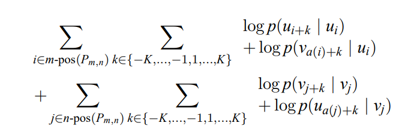
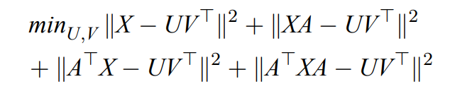
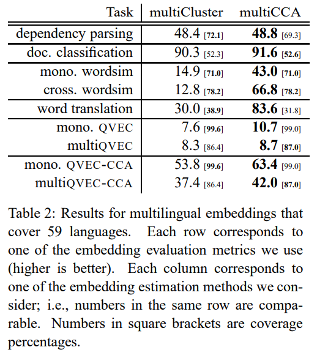
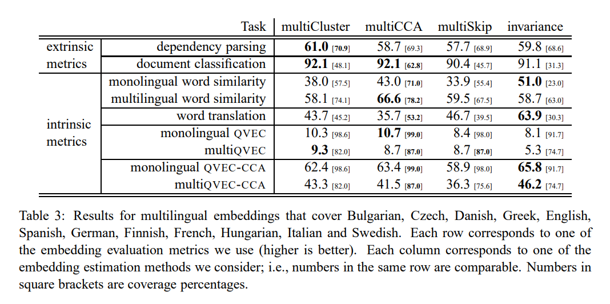

# Massively Multilingual Word Embeddings

## Index

0. Abstract
1. Introduction
2. Estimation Multilingual Embeddings
   1. Multicluster
   2. MultiCCA
   3. MultiSkip
   4. Translation-invariance
3. Experiments

## Abstract

이 논문에서는 단 하나의 embedding space에 50개가 넘는 언어의 단어들을 embedding하고 평가하는 방법에 대해서 소개하고 있다. MultiCluster과 multiCCA라고 부르는 새로운 embedding 방법은 단어 사전과 각 언어에 대한 데이터를 이용한다. 즉, 언어별 parallel data가 필요하지 않다. 또, multiQVEC-CCA라고 불리는 평가 방식은 여러 언어의 관계를 더 잘 파악할 수 있다.

## Introduction

단어들을 continuous space에 embedding하는 것은 NLP에서 자주 쓰이는 방법이다. 또, 여러 언어의 단어를 한 공간에 embedding하는 것은 추가적인 성증 향상을 할 수 있다.

1. 예를 들어, machine translation에서 한 언어의 단어에 대한 정보가 없을 때, 같은 공간에 제일 근접한 다른 언어의 단어를 출력할 수도 있다.
2. 또, transfer learning을 할 때 한 언어에 대해 학습된 모델이 있다면, 다른 언어에 그 모델을 적용하기 좋다(embedding space를 공유하기 때문에).

따라서 여러 언어의 단어를 한 공간에 embedding하는 것은 multilingual NLP를 할 때 여러 도움이 될 수 있고 이를 위해 본 논문은 다음과 같은 methods와 평가 방식을 제안한다.

MultiCluster & multiCCA: dictionary-based method로서 monolingual data와 pairwise parallel dictionary만 train할 때 필요하다. Parallel corpora는 사용가능하다면 사용할 수 있지만 필수적이지 않다.

## Estimation Multilingual Embeddings

먼저 notation을 정의하자.

- $L$: set of languages
- $V^m$: set of surface forms (아마 one-hot vector) in $m \in L$
- $V = \cup_{m \in L}V ^ m$
- $E: L\times V \rightarrow \mathbb{R}^d$: embedding function where $d$ is the dimension of the embedding space
- $M^m$: monolingual corpus of $m \in L$
- $P^{m, n}$: parallel corpus of $m, n \in L$
- $D^{m, n}$: bilingual dictionary($D^{m, n} \subset V^m \times V^n, \text{ where } m, n \in L$)

논문에서 구하고 싶은 것은 embedding function $E$다. 이 함수는 다음과 같은 성질을 만족해야한다.

1. 한 언어의 의미적으로 비슷한 단어들은 비슷한 곳에 위치시킨다.
2. 다른 언어들의 단어들이지만 번역했을 때 의미가 같은 언어들은 비슷한 곳에 위치시킨다.
3. $V$가 가능한 많은 단어들을 포함할 수 있도록 해야한다.

한 언어의 corpus $M^m$안에 있는 distribution similarity를 이용하여 한 언어의 단어들 간의 semantic similarity를 모델링할 것이며, crosslingual similarity를 나타내기 위해 parallel corpus $P^{m, n}$ 혹은 bilingual dictionary $D^{m, n} \subset V^m \times V^n$을 이용할 수 있다. 본 논문에서는 후자에 집중한다.

전에 있던 연구들은 $|L|=2$에 집중했다면, 본 논문은 $|L| > 2$인 상황에 집중하고, 두 가지 dictionary-based methods(multiCluster와 multiCCA)를 제안한다.

### Multicluster

먼저 notation을 정의하자.

- $E: L\times V \rightarrow \mathbb{R}^d := E_{embed} \circ E_{cluster}$
  - where $E_{cluster}: L\times V \rightarrow C$
    - where $C$: set of multilingual clusters
  - and $E_{embed}: C \rightarrow \mathbb{R}^d$

논문은 cluster를 connected components in a graph where nodes are pairs and edges correspond to translation entries in $D^{m, n}$라고 정의한다. 해석해보면 그래프 상에 dictionary가 같은 뜻이라고 말하는 단어들을 묶은 것이라 한다. 만약 $(v_{hi}, v_{안녕}) \in D^{En, Kr}$이 있고, $(v_{hi}, v_{こんにちは}) \in D^{En, Kr}$가 있다면 cluster 중 하나는 $\{v_{hi}, v_{안녕}, v_{こんにちは}\}$를 포함하고 있다. 이 cluster들을 이용하여 다음의 순서로 여러 언어의 단어들을 embedding한다.

1. Assign arbitrary IDs to the clusters.
2. Replace each word token in each monolingual corpus with the corresponding cluster ID.
3. Concatenate all modified corpora.
   - The resulting corpus consists of multilingual cluster ID sequences.
4. Apply any monolingual embedding estimator
   - 논문에서는 skipgram model을 사용했다.

### MultiCCA

#### Faruqui and Dyer

논문이 제안한 multilinugal embedding 모델 중 다른 하나인 MultiCCA는 Faruqui and Dyer(2014)의 bilingual embedding 방법을 확장한 것이다. Faruqui and Dyer의 bilingual embedding 방법은 다음과 같이 진행된다.

1. monolingual corpus들을 이용해 monolingual embeding들을 독립적으로 semantic similarity를 얻을 수 있게 훈련시킨다(이 과정에서 $E^m, E^n \text{ where } m, n \in L$,을 얻는다 ).
2. 그 후 bilingual dictionary $D^{m, n}$와 canonical correlation analysis (CCA)를 사용하여, $E^m$과 $E^n$의 bilingual embedding $E^{m, n}$을 얻는다.

$E^{m, n}$을 얻는 과정을 더 자세히 설명하면 먼저  $T_{m \rightarrow m, n}E^m(u)$와 $T_{n \rightarrow m, n}E^n(v) \text{ where } (u, v) \in D^{m, n}$의 correlation을 최대화하는 linear projection $T_{m \rightarrow m, n} \text{ and } T_{n \rightarrow m, n} \in \mathbb{R}^{d \times d}$를 찾아낸다. 그 다음 bilingual embedding을 $E_{CCA}(m, u) = T_{m \rightarrow m, n}E^m(u), E_{CCA}(n, v) = T_{n \rightarrow m, n}E^n(v)$로 정의한다.

Check. 논문 확인하여 $T_{m \rightarrow m, n}$를 수식으로 구하는 지 neural net으로 구하는 지 확인하기

#### MultiCCA

본 논문에서는 initial (monolingual) English embedding이 multilingual vector space를 제공하도록 한다. 후에 다른 언어들이 english space에  각 단어를 embedding할 수 있도록 한다. 이를 수식으로 관찰하면 다음과 같다.

For each $m \in L - \{en\}$, the two projection matrices: $T_{m \rightarrow m, en}$ and $T_{en \rightarrow m, en}$; these are guaranteed to be non-singular(역함수가 존재). We then define the multilingual embedding as  $E_{CCA}(en, u) = E^{en}(u)$ for $u \in V^{en}$, and $E_{CCA}(m, v) = T^{-1}_{en \rightarrow m, en}T_{m \rightarrow m, en}E^m(v)$ for $v \in V^m, m \in L - {en}$

Check. $T_{m \rightarrow m, n}$가 non-singular인지 논문 확인

### MultiSkip, 비교대상1

MultiSkip 모델은 parallel data $P^{m, n}$(source language m and target language n)에 대해 기존 skipgram을 확장한 형태로 bilingual embedding을 구하는 모델이다.  

sentential context의 위치가 정해지고(평범한 skipgram처럼) bilingual context가 aligned words로 배열되면 bilingual objective는 다음과 같다.

여기서 $m-pos(P_{m,n})$와 $n-pos(P_{m,n})$는 source와 target token의 index이고, $a(i)$, $a(j)$는 $i$와 $j$에 배정된 다른 언어의 단어의 위치이다. 이를 다른 언어에도 적용하여 embedding을 구한다.

### Translation-invariance, 비교대상2

Translation-invariance는 parallel corpus의 통계적 특성을 이용하여 embedding을 구하는 방법이다. 먼저 notation을 정의하자.

- $X \in \mathbb{R}^{|V|\times |V|}$: a matrix which summarizes the pointwise mutual information statistics between pairs of words in monolingual corpora
  - 원 논문에서는 multilingual cooccurrence matrix라고 정의되어 있음
- $UV^T$: a low-rank decomposition of $X$
  - where $U, V \in \mathbb{R}^{|V|\times d}$
- $A \in \mathbb{R}^{|V|\times|V|}$: a matrix which summarizes bilingual alignment frequencies in a parallel corpus.
  - 원 논문에는 a word dictionary matrix(frequency count)라고 정의되어 있음

이러한 notation을 사용할 때, Gardner et al(2015)는

를 최소화하는 $UV^T$를 찾으면, multilingual embeddings는 $U$의 row들로 얻어진다고 말한다.

## Experiments

1. 59 languages

   

2. Bulgarian, Czech, Danish, Greek, English, Spanish, German, Finnish, French, Hungarian, Italian, and Swedish

   

