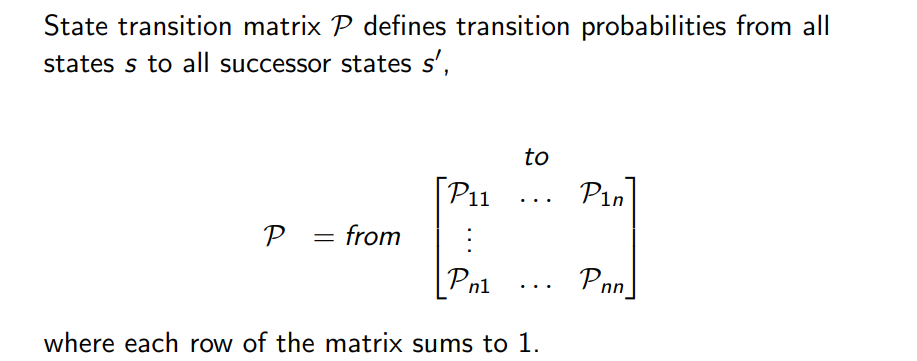
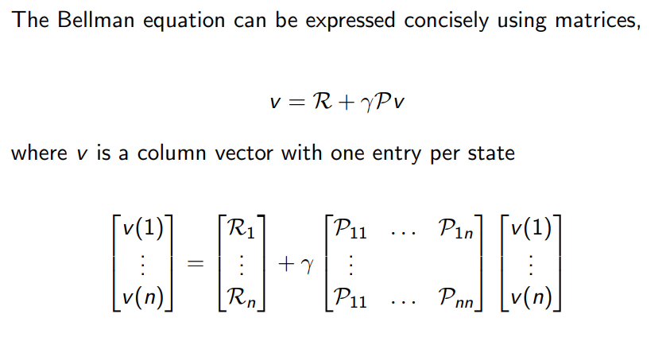
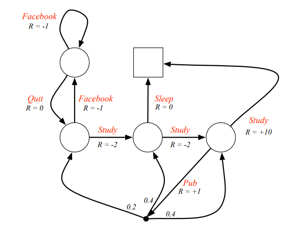
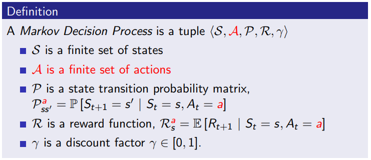
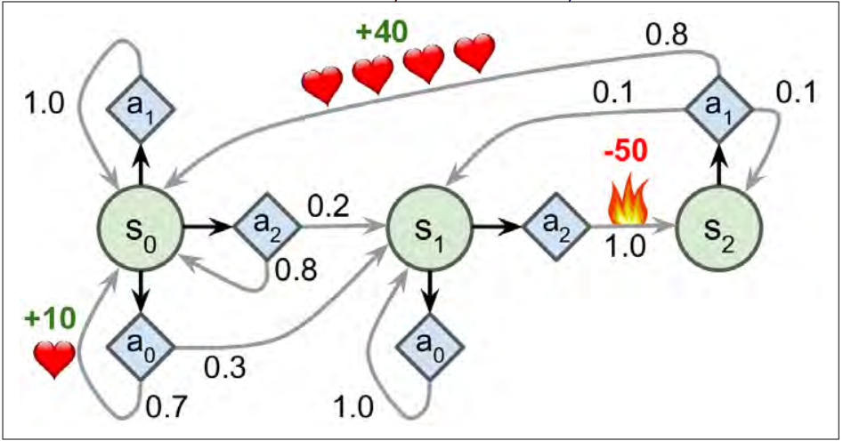
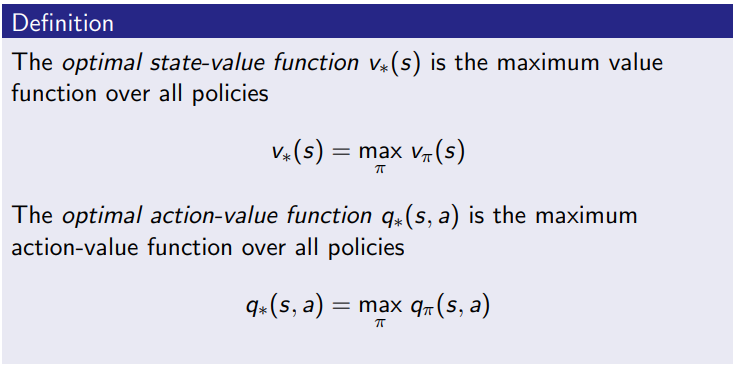
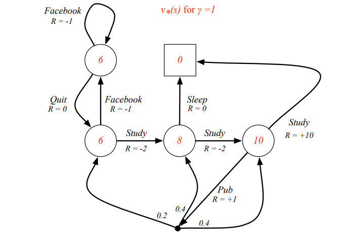
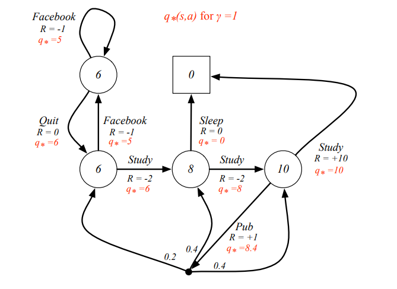
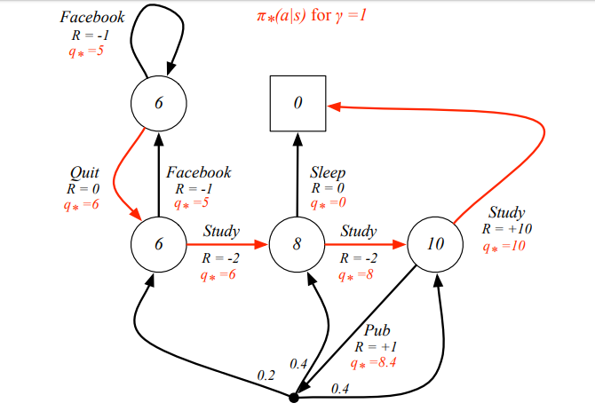

# Reinforcement Learning1

출처: http://www0.cs.ucl.ac.uk/staff/d.silver/web/Teaching.html

## Index

1. Introduction - Reinforcement Learning

   1. MDP(Markov Decision Processes), Policy & Value Function & Model

## Introduction - Reinforcement Learning

강화학습이란 어떤 환경 안에서 정의된 에이전트가 현재의 상태를 인식하여, 선택 가능한 행동들 중 보상을 최대화하는 행동 혹은 행동 순서를 선택하는 방법이다.

이 정의에서 중요한 키워드는 다음과 같다.

환경(environment)

에이전트(agent)

행동(action)

보상(reward)

행동 순서를 선택(policy)

강화 학습에서 다루는 '환경'은 주로 마르코브 결정 과정(MDP, Markov Decision Processes)으로 주어진다.

### MDP(Markov Decision Processes)

#### Markov Chains

**환경**, **에이전트**, **상태**, **행동**, **에피소드**

**environment**, **agent**, **state**, **action**, **episodes**

위에 그림은 Markov Chains의 한 예이다.

**에이전트**는 학생이며, 각 노드에 존재할 수 있다.

노드들은 **에이전트**가 있을 수 있는 **상태**(state)이다.

에이전트가 각 상태에서 취할 수 있는 **행동**들은 화살표 방향으로 가는 것이고, 에이전트가 속해있는 상태에 따라 한 행동을 선택할 확률들이 화살표에 표시되어 있다.

여기서 환경이란 이 그림이 표현하는 전반적인 상황이다. 상태는 환경에 속해있고, 에이전트는 환경을 벗어날 수 없다.

이러한 마르코브 환경에서 상태 s에서 상태 s'으로 갈 수 있는, 혹은 가게 되는 확률을 정의할 수 있는데 이를 state transition probability라고 부르고 위에 수식처럼 정의한다. 여기서 '|'는 contitional probability를 나타내는 것이 아니라, P함수가 $S_t \rightarrow S_{t+1}$인 함수라는 것을 나타낸다. 이렇게 정의된 P함수는 다음과 같이 matrix로도 정의할 수 있다.

예시의 state transition matrix는 다음과 같다. 빈곳은 0

다시 그림을 보자.

여기서 우리는 에피소드(episodes)를 정의할 수 있다. 에피소드란 에이전트가 에이전트의 시작 상태부터 종료 상태에 도달하여 움직이지 않을 때까지의 상태들을 말한다.

#### Markov Reward Process

**reward**, **discount factor**, **return**, **state value function**

Markov reward process는 value가 주어진 Markov chain이다. 

위 예시는 Markov chain을 배울 때 보았던 그림에 각 상태 별 reward를 추가한 것이다.

Markov Reward Process의 formal한 정의는 다음과 같다.

여기서 reward function은 현재 agent의 t번 째 상태가 s일 때, 다음 t+1번 째 얻을 수 있는 reward의 평균값인데, 이는 $P_{ss'}$이 정의되었기 때문에 구할 수 있다. 

이 reward와 discount factor로 return $G_t$를 정의할 수 있다.

return은 한 에피소드가 진행되었을 때, time-step t에서부터 에피소드 끝까지 받았던 reward와 discount factor의 power를 곱해 더한 값이다. discount factor가 1에 가까울 수록 미래의 reward를 중요하게 여긴다고 생각할 수 있다.

이러한 return, state를 통해 state value function v(s)를 정의할 수 있다.

이 함수는 agent의 t의 상태가 s일때, 앞으로 생각할 수 있는 episodes를 이용하여 return과 확률을 구하고, 이를 곱하고 더해 평균을 구하는 함수이다.

이러한 state value function을 구할 수 있게 하기 위한 필수적인 공식이 있는데 이는 Bellman equation이라고 한다.

Theorem1. Bellman equation.

​	$$v(s) = R_s + r \sum_{s'\in S} P_{ss'}v(s')$$

proof)

$\begin{matrix}
v(s) &=& \mathbb{E}[G_t | S_t = s] \\
       &=& \mathbb{E}[R_{t+1} + \gamma R_{t+2} +\gamma^2R_{t+3} + \cdots | S_t = s] \\
       &=& \mathbb{E}[R_{t+1} + \gamma (R_{t+2} +\gamma R_{t+3} + \cdots) | S_t = s] \\
       &=& \mathbb{E}[R_{t+1} + \gamma G_{t+1} | S_t = s] \\
       &=& R_s + r \sum_{s'\in S} P_{ss'}v(s') \\
\end{matrix}$

이 Bellman equation을 matrix를 이용하여 간결하게 쓸 수 있다.

Bellman equation은 하나의 선형방정식이기 때문에 바로 솔루션을 구할 수 있다. 하지만 이 솔루션의 계산복잡도는 $O(n^3)$(n은 state의 개수)이기 때문에 state의 개수가 너무 많다면 계산하기 어렵다.

#### Markov Decision Process

**policy**, **action-value function**

Markov Decision Process란 decision이 있는 Markov reward process다.

자세한 정의는 다음과 같다.

MDP에서는 한 state에서 다른 state로 넘어갈 때, action이라는 요소가 추가된다. 이에 따라 reward function에도 변화가 생겼다. 본 예제에서는 행동을 선택한다면 다음 state가 1의 확률로 정해지지만 MDP에서는 꼭 그래야한다는 보장은 없다. 예시 그림은 다음과 같다.

우리는 이제 action에 대한 선택이 생겼고 이에 대한 전략을 policy라고 말한다. policy는 action을 정하는 확률 분포 함수 형태로 표현되며 자세한 정의는 다음과 같다.

이러한 policy에 따라 추가적인 notation인 $P^{\pi}_{s, s'}, R^{\pi}_{s}$의 정의가 필요하다.

이제 확률 P와 reward R에 대한 정의가 생겼으니 state-value function을 다시 정의할 수 있다. 

이제 추가로 action-value function을 정의한다. action-value function은 t 번째 state에서 특정 a라는 action을 취했을때, 얻게 되는 return의 평균값을 나타내는 함수다.

이를 이용해 optimal function들을 정의할 수 있다.

policy $\pi$에 의해 결정되는 $v_\pi(s)$과 $q_{pi}(s, a)$도 Bellman equation으로 표현할 수 있다.

Theorem2. Bellman Expectation Equation

- $v_\pi(s) = \sum_{a \in A}\pi(s|a)(R^a_s + \gamma \sum_{s'\in S}P^a_{ss'}v_\pi(s'))$
- $q_\pi(s, a) = R^a_s + \gamma \sum_{s'\in S}P^a_{ss'}\sum_{a\in A}\pi (a'|s')q_\pi(s', a')$

proof)

we can rewrite 

​	$v_\pi(s) = \sum_{a\in A}\pi(a|s)q_\pi(s, a)$. (1)

Also, 

​	$q_\pi(s, a) = R^a_s + \gamma\sum_{s' \in S}P^a_{ss'}v_\pi(s')$. (2)

So, combining (1) and (2), we can conclude the theorem2.

Theorem3.

For any Markov Decision Process, there exists an optimal policy $\pi_*$ that is better than or equal to all other policies, i.e.. $v_{\pi_*}(s) \geq v_\pi(s), q_{\pi_*}(s, a) \geq q_\pi(s, a), \forall \pi$ and $v_{\pi_*}(s) = v_*(s), q_{\pi_*}(s, a) = q_*(s, a)$

#### Finding an Optimal Policy

Optimal Policy는 $q_*(s, a)$를 최대화하면서 얻을 수 있다.

어떠한 MDP에서도 deterministic한 optimal policy를 찾을 수 있다.

Optimal Value Function for Student MDP

Optimal Action-Value Function for Student MDP

Optimal Policy for Student MDP

우리는 결국 밑에 있는 식을 만족하는 $v_*(s)$ 혹은 $q_*(s, a)$를 구해내면 된다.

- $v_*(s) = max_a(R^a_s + \gamma \sum_{s'\in S}P^a_{ss'}v_\pi(s'))$
- $q_*(s, a) = R^a_s + \gamma \sum_{s'\in S}P^a_{ss'}max_{a'}( q_\pi(s', a'))$

하지만 위 방정식은 non-linear이고 MRP처럼 역행렬을 이용해 구할 수 없다. 따라서 다른 solution method이 알려져 있다.

- Value Iteration
- Policy Iteration
- Q-learning
- Sarsa
