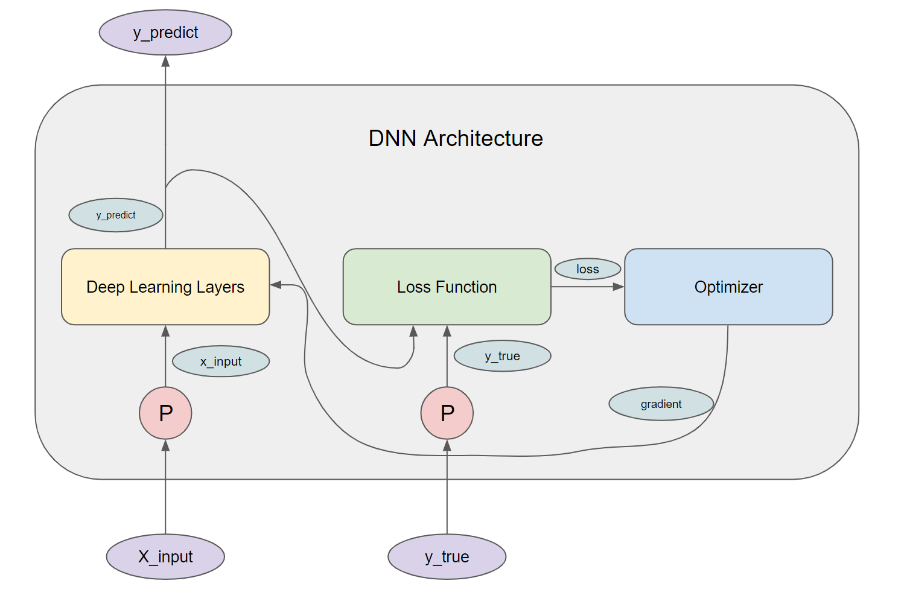
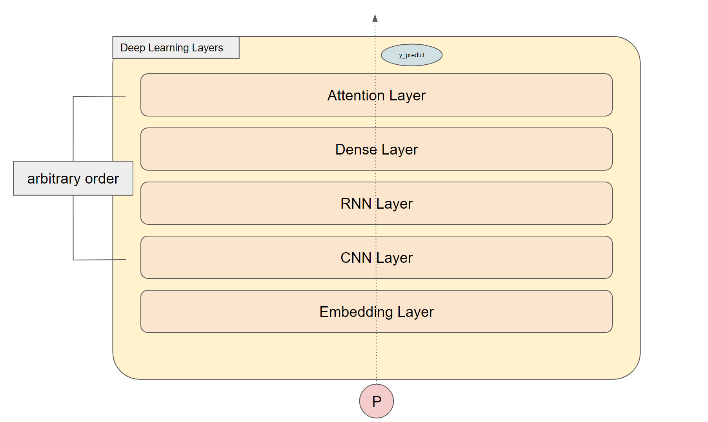
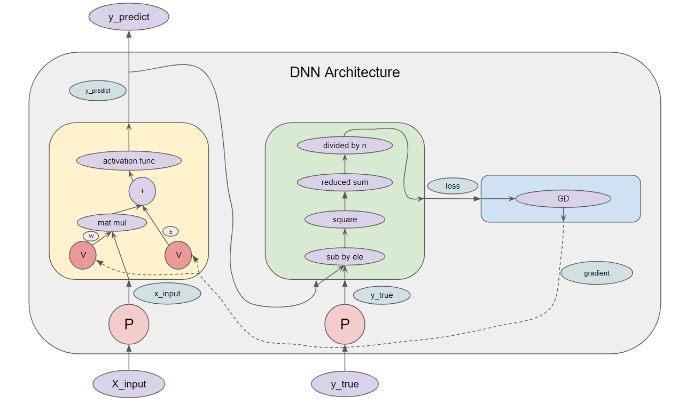

# Deep Learning

DNN learning에서 일어나는 일들을 간략히 살펴보자.

## Index

1. DNN Architecture
2. Deep Learning Layers
3. Loss Function
4. Optimizer
5. Practice

## DNN Architecture

위에 그림은 딥러닝이 어떻게 돌아가는지에 대한 그림이다. 그림에 대한 설명은 다음과 같다.

- 원 P: placeholder, 사용자가 feed_dict 등으로 실제로 넣어주는 값을 받는 노드
- 보라색 타원: 사용자가 주입할 데이터의 input과 label data 혹은 DNN Architecture가 출력하는 output
- 화살표 옆에 있는 타원: 다음 노드에 입력되는 텐서
- Deep Learning Layers 노드, Loss Function 노드, Optimizer에 대해서는 나중에 자세히 다루겠다.

DNN architecture가 가중치를 업데이트하는 방식은 다음과 같다.

1. Placeholder에 input data를 받는다.
2. Deep Learning Layers 노드에 placeholder 노드의 출력 텐서를 입력한다.
   - Deep Learning Layers 노드는 X_input의 정보가 들어있는 텐서를 이용해 y의 예측값을 가진 텐서를 출력한다.
   - test시에는 텐서에 저장된 정보를 결과로 사용하면 된다.
3. y의 예측값과 y의 실제값에 대한 정보를 가진 텐서를 Loss Function 노드에 입력하고 loss를 구한다.
4. Optimizer 노드에서 이 loss를 줄일 수 있는 방향을 나타내는 gradient를 구해 Deep Learning Layers에 입력한다.
5. Deep Learning Layers의 가중치들을 이 gradient를 이용해 업데이트한다.
6. 1-5번을 epoch만큼 반복한다.

## Deep Learning Layers

### Layers

Deep Learning Layers 노드를 구성할 수 있는 layer들은 여러 종류가 있다. 

- Dense layer

- Embedding layer

- CNN layer

- RNN layer

- Attention layer

- Dropout layer

  ...

layer란 결국 pre-layer의 출력값을 input으로 받아 output을 출력하는 함수라고 볼 수 있다. 이 출력값의 형식은 필요에 따라 1차원 vector가 될 수도 있고 2차원 vector 혹은 훨씬 큰 고차원의 vector가 될 수도 있다. 여러 종류의 layer가 있는 만큼 각각의 layer의 사용처와 장단점들이 있으며, 각각을 여러번 쌓거나 서로 다른 layer들을 섞어서 사용할 수도 있다. 

### Dense layer

- $W$: dense layer에 사용되는 가중치 matrix

  ​	ex)

  - $W = \begin{bmatrix}
    \theta_{11} & \theta_{12} & \theta_{13} \\
    \theta_{21} & \theta_{22} & \theta_{23} \\
    \theta_{31} & \theta_{32} & \theta_{33} \\
    \theta_{41} & \theta_{42} & \theta_{34} \\
    \end{bmatrix}$
    - n of row: the number of hidden neurons of dense layer
    - n of column: the number of pre-layer's hidden neurons

- $b$: dense layer에 사용되는 가중치 bias

  ​	ex)

  - $b = \begin{bmatrix}
b_1 \\
b_2 \\
b_3 \\
b_4 \\
\end{bmatrix}$

- $H$: dense layer의 W와 b를 통해 출력되는 값

  ​	ex)

  - $H = \sigma(WX + b) \text{ where } X \text{ is the output of the pre-layer.}$
  - $\sigma = tanh \text{ or } ReLU \text{ or } IdentityMapping \text{ etc. (a.k.a. activation function)}$
    -  https://en.wikipedia.org/wiki/Activation_function 
    - 대부분의 activation function은 증가함수다.

## Loss Function

Loss function 노드의 loss function은 문제에 따라 정해주어야 한다. loss function의 예시들은 다음과 같다.

- RMSE

- MSE

- Cross entropy

  ...

Loss function은 deep learning layers가 출력한 output이 실제 y와 얼마나 차이나는지를 구하는 함수이다. 이 함수의 input은 deep learning layers의 가중치들이고 출력값은 deep learning layers의 output과 실제 y의 차이(사실 차이라는 말은 정확하지 않다, ex) cross entropy)다. Loss function이 되기 위한 특징은 deep learning layers의 output이 실제 y에서 멀어질 수록 loss function의 값이 커져야 한다는 것이다. 앞으로 loss function의 값을 loss라고 하겠다.

### MSE

​	 $\operatorname {MSE} ={\frac {1}{n}}\sum _{i=1}^{n}(Y_{i}-{\hat {Y_{i}}})^{2}$

​	$\text{ where } n \text{ is the number of data, } Y_i \text{ is the true output of the i-th input and } $

​	$\hat{Y_i} \text{ is the predicted value of the deep learning layers of the i-th input}.$

## Optimizer

다시한번 집고 넘어가자면, loss function은 deep learning layers에서의 가중치들의 공간($\Theta$ space)의 vector를 하나의 real number로 mapping하는 함수다. 그리고 DNN의 목적은 모든 데이터에 대해 loss를 가장 낮게 만드는 가중치를 찾는 것이다. 이를 바꿔말하면 loss function의 극솟값을 찾는다는 것과 같은 말이다.

loss function의 극솟값을 찾기 위해 loss function을 $\Theta$ space에 대해 미분하고 미분값이 0이 되는 점들 찾고 조사할 수도 있지만 미분값이 0이 되는 지점을 찾는 것은 계산 비용이 너무 많이 든다.

차선책으로 $\Theta$ space에서 임의의 vector 하나를 추출하고 이 vector에서 가장 가파른 방향(gradient)으로 조금씩 내려가는 방법을 사용한다. 이는 loss function이 $\Theta$ space에 대해 최적점이 하나(local minimum = global minimum)라면 수렴성이 보장되지만, 안타깝게도 우리가 푸는 문제들은 대게 그렇지 못하다. 이를 위해 임의의 한 시작점에서 가장 가파른 방향으로 조금씩 내려가다가 local minimum에 도착하더라도 이 지점을 통과하여 global minimum을 향해 가기 위한 방법들이 연구되고 있다.

### Gradient

우리가 넓은  $\Theta$ space에서 loss function의 최적점을 찾기 위해 쓸 수 있는 방법은 $\Theta$ space에서 임의의 vector 하나를 추출하고 이 vector에서 가장 가파른 방향(gradient)으로 조금씩 내려가는 방법 밖에 없지만, 이것도 문제가 있다.

Loss function의 gradient를 구하기 위해서 loss function을 $\Theta$ space의 기저들의 방향으로 derivative를 구해야하는데 계산량에 영향을 주는 것은 1. $\Theta$ space의 기저의 개수 2. 데이터의 개수가 있다. 

$\Theta$ space의 기저의 개수는 deep learning layers의 가중치의 개수와 같은데 DNN의 가중치의 개수와 데이터의 개수를 고려해볼 땐 엄청난 계산량이 필요하다는 것을 알 수 있다. 이 계산량을 줄이기 위해서는 당연하게도 1. $\Theta$ space의 기저의 개수를 줄이가나 2. 데이터의 개수를 줄여야한다.

$\Theta$ space의 기저의 개수는 deep learning layers의 가중치의 개수와 같기 때문에 이 기저의 개수를 줄인다는 것은 DNN 모델을 바꾼다는 것과 같은 의미임으로 기저의 개수를 줄이는 것은 고려하지 않는다.

우리는 loss function을 미분할 때 데이터의 개수를 줄이는 방법을 시행할 것이고 자세한 방법은 다음과 같다.

1. 데이터의 sample을 추출한다(비복원 추출).
2. sample에 대한 loss function의 gradient를 구한다.
3. 이를 이용해 가중치를 업데이트한다.
4. 1-3번을 모든 데이터를 볼 때까지 반복한다.

- 여기서 $\text{n of sample}=1$이면 SGD, $\text{n of sample} > 1$이면 MGD, $\text{n of sample} = \text{n of data}$면 GD라고 부른다.

### Optimizer

가중치를 업데이트하는 가장 기본적인 공식은 다음과 같다.

- $\theta = \theta - \eta  \bigtriangledown_{\theta}LossFunction(\theta) $

기본적인 방식 이외에 여러 optimizer가 있다.

- Momentum optimization
- Nesterov Momentum optimization
- AdaGrad optimization
- RMSProp optimization
- Adam optimization

## Practice

지금까지 알아본 DNN architecture의 요소와 진행방식에 대해 알아봤는데, 제일 간소화한 DNN architecture를 통해 딥러닝이 어떻게 학습되는지 알아보자.

### Data

  - $X = \begin{bmatrix}
    X_{11} & X_{12}  \\
    X_{21} & X_{22}  \\
    X_{31} & X_{32}  \\
    X_{41} & X_{42} \\
    \end{bmatrix}$
      - $X$: input data
      - n of row: the number of attributes of a data
      - n of column: the number of data
- $y = [y_1, y_2]$
  - $y$: label
  - n of column: the number of data 

### Deep Learning Layer

- layer1: a dense layer with 4 hidden neurons, bias, and the identity mapping activation function 
- layer2: a dense layer with 1 hidden neurons, bias, and the identity mapping activation function

### Loss Function

- $LossFunction(\theta) = MSE(\theta)$

### Optimizer

- Do not use any optimizer.
- $\eta = 0.1$

### Other Hyperparameters

epoch=1

#### Problem: predict the output value of $X = [1, 2, 3, 4]$

