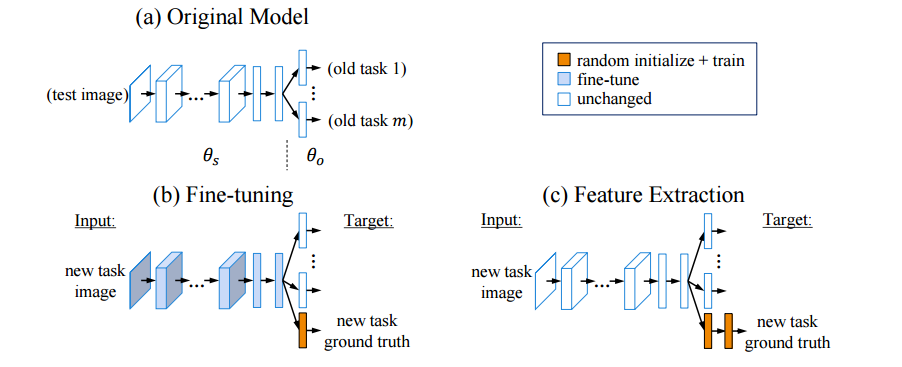
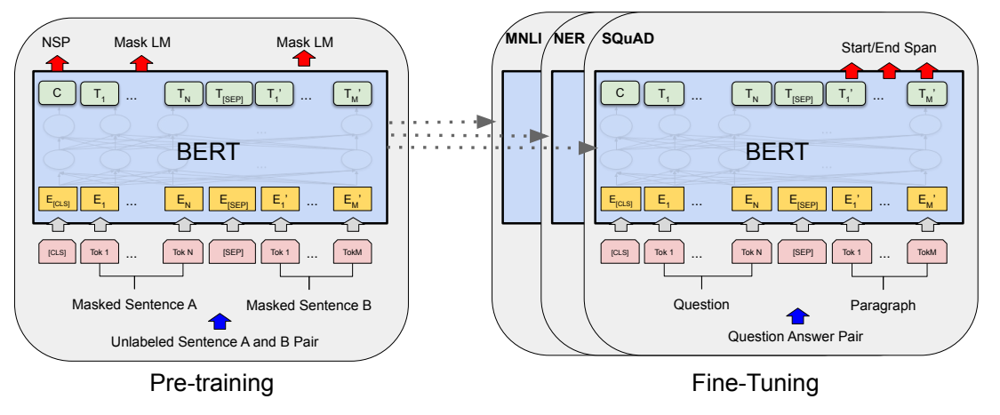
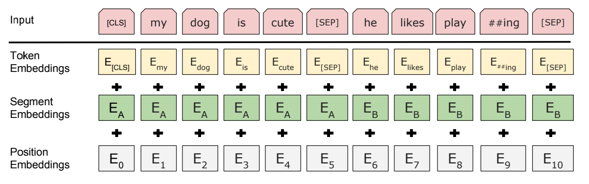
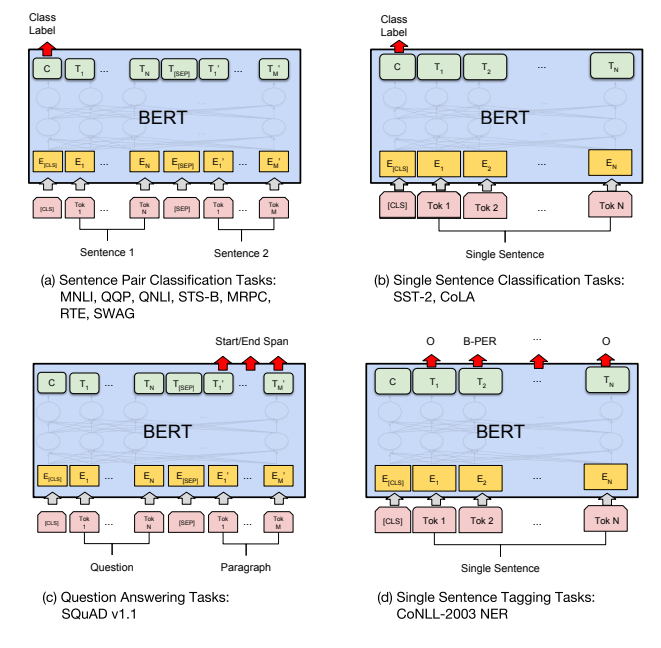

# BERT

## Index

1. Introduction of BERT
2. Preliminary
   1. Feature-Based Approaches vs. Fine-Tuning Approaches
   2. WordPiece Embeddings
3. BERT
   1. Model Architecture
   2. Input/Output Representations
      1. Token, Segment, Position Embeddings
   3. Pre-training BERT
      1. Masked LM
      2. Next Sentence Prediction (NSP)
      3. Pre-traning data
   4. Fine-tuning BERT
4. Experiments
   1. GLUE
   2. SQuAD v1.1
   3. SQuAD v2.0
   4. SWAG

## Introduction of BERT

BERT는 **B**idirectional **E**ncoder **R**epresentations from **T**ransformers의 약자로서 pre-trained language representation 모델 중 하나다. BERT가 지적하는 기존 pre-trained language representation 모델들은 unidirectional 모델이라는 것이다. 이런 모델은 question answering같은 문맥 전체를 중요하게 봐야하는 문제에 대해서는 치명적이다. BERT는 "masked language model" (MLM)과 "next sentence prediction" (NSP)을 사용하여 이 문제를 해결한다. MLM은 input의 token 중 몇 단어를 가린 후 남은 단어를 이용하여 가린 단어를 예측하는 모델이다. NSP는 input으로 두 개의 문장이 들어올 때 두 번째 문장이 첫 번째 문장과 상관이 있는지 없는지 판단하며 주어진 input을 이해한다. MLM과 NSP는 뒤에서 자세하게 다루겠다.

## Preliminary

### Fine-Tuning Approaches vs. Feature-Extraction Approaches

출처:   https://arxiv.org/abs/1606.09282

DNN을 할 때는 미리 훈련된 층을 재사용하는 경우가 많다. 미리 만들어진 층을 재사용할 때는 대표적으로 두가지 방법이 있다.

1. Fine-Tuning Approaches
2. Feature Extraction

Fine-tuning은 외부에서 가져온 층의 parameters를 task를 진행하는 동안 바뀔 수 있게 하는 방법이고, feature extraction은 외부에서 가져온 층의 parameters는 변화하지 않게 하는 방법이다. BERT 논문에서는 주로 fine-tuning을 사용한다.

### WordPiece Embeddings

단어를 tokenize할 때, 어느정도까지 단어로 인정할지 고민해야한다. playing이라는 단어와 play라는 단어가 코퍼스에서 등장했다면 이 두 단어를 모두 단어 사전에 넣는 것은 어찌보면 비효율적일 수 있다. playing에서 의미를 갖는 것은 play이고 ing는 접미어뿐이기 때문에 단어 사전에는 play와 -ing가 들어있는 것이 더 효율적이라고 생각될 수 있다. WordPiece Embeddings은 이러한 접두어와 접미어를 구분하여 단어 사전에 넣는 방법 중 하나이다(추가적으로 OOV문제를 해결할 수도 있다).

Wordpiece embedding 알고리즘은 다음과 같다.

1. 한 문장을 단어별로 자른다.
2. 한 단어를 byte 단위로 자른다.
3. bi-gram으로 두 pair를 확인하며 가장 빈도수가 높은 pair를 합친다(반복, 횟수는 사용자가 정해주어야 함).

예시를 통해 자세히 알아보자. 만약 우리의 코퍼스가 "platfarm is an awesome platform for creaters"라면 wordpiece embedding은 다음과 같이 진행된다.

1. 단어별로 자르기

   platfarm, is, an, awesome, platform, for, creaters

2. byte 단위로 자르기

   p, ##l, ##a, ##t, ##f, ##a, ##r, ##m, i, ##s, a, ##n, a, ##w, ##e, ##s, ##o, ##m, ##e, p, ##l, ##a, ##t, ##f, ##o, ##r, ##m, f, ##o, ##r, c, ##r, ##e, ##a, ##t, ##e, ##r, ##s

   byte 단위로 자를 때, 단어의 시작인 byte에는 ##을 붙이지 않는다. 

   이 byte 단위로 잘린 문자들의 중복이 제거되면 이 문자들은 단어 사전의 단어 후보들이다.

3. iter1

   1. bi-gram으로 두 pair를 확인하며 빈도수를 구한다.

      | pair | count |
      | ---- | ----- |
      | pl   | 2     |
      | la   | 2     |
      | at   | 3     |
      | tf   | 2     |
      | fa   | 1     |
      | ar   | 1     |
      | rm   | 2     |
      | ...  | ...   |

   2. 가장 높은 빈도수를 가진 pair를 하나의 단어로 합친다.

      p, ##l, ##at, ##f, ##a, ##r, ##m, i, ##s, a, ##n, a, ##w, ##e, ##s, ##o, ##m, ##e, p, ##l, ##at, ##f, ##o, ##r, ##m, f, ##o, ##r, c, ##r, ##e, ##at, ##e, ##r, ##s

      이 문자들의 중복이 제거된 문자들은 단어 사전의 단어 후보들이다.

4. iter2

   1. bi-gram으로 두 pair를 확인하며 빈도수를 구한다.

      | pair | count |
      | ---- | ----- |
      | pl   | 2     |
      | lat  | 2     |
      | atf  | 2     |
      | fa   | 1     |
      | ar   | 1     |
      | rm   | 2     |
      | ...  | ...   |

   2. 가장 높은 빈도수를 가진 pair를 하나의 단어로 합친다.

      중복이 있다면 가장 처음 나온 단어의 pair를 하나의 단어로 합친다.

      pl, ##at, ##f, ##a, ##r, ##m, i, ##s, a, ##n, a, ##w, ##e, ##s, ##o, ##m, ##e, pl, ##at, ##f, ##o, ##r, ##m, f, ##o, ##r, c, ##r, ##e, ##at, ##e, ##r, ##s

      이 문자들의 중복이 제거된 문자들은 단어 후보들이다.

   iteration이 적당히 반복된다면 다음과 같은 단어 후보가 있을 것이다.

   platf, ##a, ##rm, i, ##s, a, ##n, ##w, ##e, ##o, ##m, ##rm, f, ##r, c, ##at

   코퍼스가 커지고 반복 횟수가 늘어난다면, 단어는 단어로 인지하며, 이 중 접두사와 접미어를 구분할 수 있게 될 것이다.

## BERT

BERT의 구조는 위에 그림과 같다. BERT는 nlp task를 해결하기 위해 2 스텝을 밟는다. 

1. Pre-Training
2. Fine-Tuning

Pre-Training 단계에서는 task에 상관없이 BooksCorpus (Zhu ea al., 2015)와 English Wikipedia를 이용하여 비지도 학습을 해 parameter들을 조정하고 fine-traning 단계에서는 우리의 목적 task에 맞는 데이터를 이용하여 parameter들이 세부조정 된다. 

### Model Architecture

BERT의 모델 구조는 Transformer encoder를 여러개 쌓은 모습을 하고 있다. 이에 사용된 hyperparameter는 다음과 같다.

- L: the number of transformer encoder layers
- H: the hidden size
- A: the number of self-attention heads
- $BERT_{BASE}: L=12, H=768, A=12, total_parameters=110M$
  - $BERT_{BASE}$는 Open AI의 GPT와 비슷한 parameter 개수를 갖게 조정한 모델이다.
- $BERT_{LARGE}: L=24, H=1024, A=16, total_parameters=340M$

### Input/Output Representations

#### Input

##### Token, Segment, Position Embeddings

BERT 논문에서 사용되는 "sentence"는 일반적으로 알고 있는 문장이라기 보다는 단어, 문장, 혹은 문단이 될 수도 있다. BERT에는 "sentence"가 1개가 들어올 수도 있고, 2개가 들어올 수도 있다(e.g., \<Question, Answer\>). 이렇게 들어온 문장 혹은 문장들의 token들을 "sequence"라고 칭한다.

- token들은 WordPiece embedding을 통해 정의한다(token embeddings). 또 [CLS]라는 classification token을 모든 sequence의 첫 token으로 한다. 이 [CLS]는 분류 task에서 sequence의 정보를 취합하는데 사용된다. 
- BERT의 input으로 sentence pairs가 들어온다면 [SEP] token을 이용하여 분리한다. 추가로 첫 번째 문장을 뜻하는 embedding vector $E_A$, 두 번째 문장임을 뜻하는 embedding vector $E_B$를 token의 embedding vector에 더해준다(segment embeddings). 
- Position embedding도 추가로 더해준다(position embeddings).

#### Output

출력으로 나오는 output에 대해 살펴보면, [CLS]는 $C \in \mathbb{R}^H$ 그리고 i번째 input token은 $T_i \in \mathbb{R}^H$로 표기한다.

### Pre-training BERT

2개의 step 중에 첫번째 스텝인 비지도 학습을 통한 parameter들의 학습을 알아보자. 이 과정에서는 두가지 방법을 사용해 parameter들을 학습한다.

#### Masked LM

Masked Language Model은 input token들의 일정 비율을 가리고 나머지 token들을 이용하여 가려진 token을 맞추는 모델이다. 가려진 token의 output vector는 softmax 함수에 들어가게 된다. BERT 논문에서는 한 sequnece의 15%를 가리고 예측한다.

하지만 이러한 방식은 문제가 있다. Fine-tuning을 할 때는 [MASK] token이 없기 때문에 pre-trained 과정과  fine-tuning 과정이 매치가 되지 않는다. 이러한 차이에서 발생하는 오류를 조금이라도 완화하기 위해 15%로 선택된 단어들을 전체 횟수의 80%에는 [MASK] token으로 대체하고, 10%에는 random token으로 대체되며, 10%에는 바뀌지 않은 상태로 둔다. 만약 한 sequence에서 15% 비율로 가릴 단어를 선택할 때, i번째 token이 선택되었다면, 80%, 10%, 10%의 비율로 [MASK], random token, unchanged token으로 대체하고, $T_i$를 통해 original token을 예측한다.

#### Next Sentence Prediction (NSP)

Fine-tuning에서 해결하고 싶은 task가 Question Answering(QA)) 혹은 SWAG와 같은 Natural Language Inference (NLI)라면 sequence는 두 개의 sentence로 구성되게 되고 이 두 sentence들의 관계를 이해하는 것은 중요해진다. 이러한 두 sentence의 관계를 이해하기 위해서 BERT는 pre-training dataset에서 두 문장 A와 B를 추출한다. 50% 비율은 문장 A 뒤에 오는 문장 B를 추출하여 훈련시키고(labeled as `IsNext`), 나머지 50% 비율은 문장 A와는 상관없는 문장 B를 추출하여 훈련시킨다(labeled as `NotNext`). 훈련이라 하면 A, B를 input으로 넣고 나온 [CLS]의 출력값인 $C$를 이용해 label을 예측하는 것이다. 논문에서는 이런 간단한 방법을 통해 QA와 NLI에서 높은 성과를 얻었다고 말한다.

#### Summary of Pre-Training

Pre-training은 BooksCorpus, English Wikipedia의 글자 데이터를 가지고, wordpiece embedding으로 토큰화된 단어들을 token embedding, segment embedding, position embedding을 통해 embedding하고,  MLM, NSP task를 해결하며 model architecture의 parameter들을 훈련시킨다.

### Fine-tuning BERT

Pre-training된 BERT를 이용해 많은 실제 문제들을 해결할 수 있다. Pre-training된 BERT를 특정한 NLP task를 위해 fine-tuning을 하게 될텐데, 이는 input을 문제 데이터로 바꾸고 출력된 $C, T_1, ... T_{last}$를 이용해 output 포맷을 만들고 실제값과 비교하면 된다.

Fine-tuning은 pre-training과 비교해서 계산 비용이 적게 든다고 한다.

## Experiments

실제 문제들을 예시로 보며 fine-tuning이 어떻게 이루어지는지 확인하자.

### GLUE

GLUE의 input은 single sentence가 들어올 수도 있고, sentence pairs가 들어올 수도 있다. GLUE 문제를 해결하기 위해서 우리는 [CLS]의 출력 vector인 $C \in \mathbb{R}$를 이용할 것이다. $C$를 input sentence(s)의 내용을 함축적으로 가지고 있는 벡터로 만들어서(Transformer 덕분에 가능) output을 출력할 때는 classification layer weights $W \in \mathbb{R}^{K\times H}, \text{ where } K \text{ is the number of labels }$만 추가한다면, GLUE의 classification 문제를 해결할 수 있다.

### SQuAD v1.1

Question answering task를 해결할 때는, variable $S \in \mathbb{R}^H$와 $E \in \mathbb{R}^H$만 추가해주면 된다. 각 $T_i$와 $S$를 이용해 $P_i=\frac{e^{S \cdot T_i}}{\sum_j e^{S \cdot T_j}}$를 구하면 i번째 단어가 답문의 시작 위치일 확률을 구할 수 있다. $E$를 이용해 한 단어가 답문의 끝의 위치일 확률도 구할 수 있으며, 이 두 확률 분포와 실제 시작 위치와 끝 위치를 cross entropy loss에 넣어 비교하고 gradient를 구하면 fine-tuning을 할 수 있다.

### SWAG

SWAG dataset을 위해 fine-tuning을 한다면, 주어진 sentence(sentence A)와 possible continuation(sentence B)을 이은 4개의 input sequece를 만들고 각 sequence의 $C$를 구한다. 이 각각의 $C$와 내적할 수 있는 Task specific parameters를 추가로 variable을 이용해 만들고 이 vector와 C의 내적 결과를 이용해 softmax score를 구해 실제 값과 비교하면 SWAG에 맞는 fine tuning을 할 수 있다.

