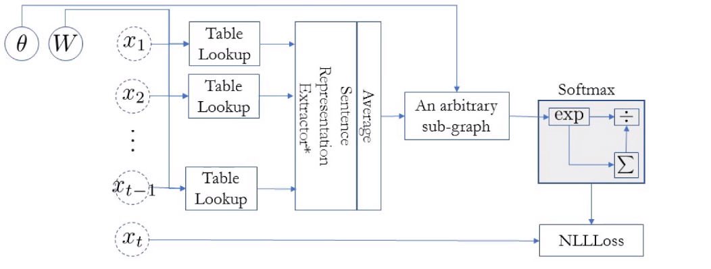
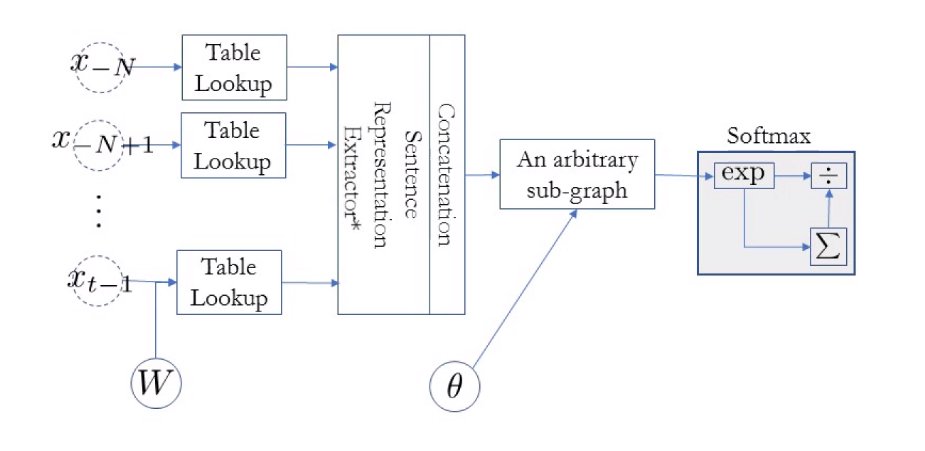

# Neural Language Models, 강의 내용 정리

## Index

1. Overview: Language Modelling
2. Autoregressive Language Modelling
3. N-Gram Language Models
4. Neural N-Gram Language Model
5. Long Term Dependency
6. Summary

## Overview: Language Modelling

Language Modelling이란 input으로 sentence를 받고 output으로 input sentence의 타당한 정도를 나타내는 확률을 출력하는 모델링이다. Language model은 모든 sentence의 확률 분포를 잡아내야 한다.

​	$P(X) = p((x_1, x_2, \cdots, x_T))$

Language modelling 문제는 language generation하는 문제와 equivalent한데, 그 이유는 한 sentence를 scoring하는 function이 있다면, language generation을 할 때, 이 function을 이용하여 가장 score가 높은 token을 다음 token으로 설정하면 되기 때문이다.

text classification과는 다르게 unsupervised learning이다. 우리는 어떻게 이 문제를 supervised learning으로 바꿀 것인가를 배울 것이다. 

## Autoregressive Language Modelling

Autoregressive sequence modelling은 next token의 확률 분포는 previous tokens로 결정된다고 생각하는 modelling이다.

​	$P(X) = p(x_1)p(x_2|x_1) \cdots p(x_T|x_1, \cdots, x_{T-1})$

만약 Autoregressive Language modelling을 사용한다면 language modelling을 unsupervised learning problem에서 supervised learning problem으로 바꿀 수 있다. 왜냐하면 하나의 conditional distribution은 classifier로 나타낼 수 있다. 즉, input은 모든 previous tokens (a partial sentnece)가 되고 output은 모든 가능한 next token들의 distribution이다. 다시말해 text classification problem으로 문제를 바라볼 수 있다.

- Autoregressive sequence modelling $p(x) = \prod^T_{t=1} p(x_t|x_{<t})$
- Loss function: the sum of negative log-probabilities
  - $\operatorname{log} p_{\theta}(X) = \sum^{N}_{n=1}\sum^{T}_{t=1} \operatorname{log}p_{\theta} (x_t|x_{<t})$

## N-Gram Language Models

Neural network가 유행하기 전에는 어떻게 setence의 점수를 측정했을까?

일단은 n-gram probability가 필요하다. 

​	$p(x|x_{-N}, x_{-N+1}, \cdots, x_{-1}) = \frac{p(x_{-N}, x_{-N+1}, \cdots, x_{-1}, x)}{\sum_{w\in V}p(x_{-N}, x_{-N+1}, \cdots, x_{-1}, w)}$

- V: all possible tokens (=vocabulary)

그렇다면 이 확률은 어떻게 구할 수 있을까?

1. 실제로 n-gram $(x_{-N}, x_{-N+1}, \cdots, x_{-1}, x)$이 몇 번 나왔는지 세고
2. $(x_{-N}, x_{-N+1}, \cdots, x_{-1}, ?)$과 같이 생긴 n-gram은 몇 번 나왔는지 세면 확률을 구할 수 있다.

- $p(x|x_{-N}, x_{-N+1}, \cdots, x_{-1}) \simeq \frac{c(x_{-N}, x_{-N+1}, \cdots, x_{-1}, x)}{\sum_{w\in V}c(x_{-N}, x_{-N+1}, \cdots, x_{-1}, w)}$

### N-Gram Language Model - Two problems

하지만 이런 n-gram language model에는 두가지 문제가 있다.

1. Data sparsity: lack of generalization

   - 만약 합리적인 문장이지만 n-gram에서 단 한번도 나오지 않았다면 language model은 문장의 확률을 0으로 출력할 것이다.

     $p(\text{a lion is chasing a llama}) = p(a) \times p(lion|a) \times p(is|\text{a lion}) \times \cdots \times p(llama|\text{chasing a}) = 0 $

     $\text{ since } p(llama|\text{chasing a}) = 0$

2. Inability to capture long-term dependencies

   1. n-gram 모델은 n개의 단어 밖에 보지 못한다.
   2. *"the same stump which had impaled the car of many a guest in the past thirty years and which **be refused to have** removed"* 이런 문장을 생각해보면 모델이 앞에 4 단어를 보고 removed를 예측하기에는 어려울 것이다.

해결방안

1. Data sparsity

   - Smoothing: add a small constant to avoid 0.
     - $p(x|x_{-N}, x_{-N+1}, \cdots, x_{-1}) \simeq \frac{c(x_{-N}, x_{-N+1}, \cdots, x_{-1}, x) + \epsilon }{\epsilon|V| + \sum_{w\in V}c(x_{-N}, x_{-N+1}, \cdots, x_{-1}, w)}$
   - Back off: try a shorter window.
     - $c(x_{-N}, \cdots, x) = \begin{cases}
       \alpha c(x_{-N+1}, \cdots, x) + \beta, & \mbox{if }c(x_{-N}, \cdots, x) = 0 \\
       c(x_{-N}, \cdots, x), & \mbox{otherwise }
       \end{cases}$
     - 제일 많이 쓰이는 방법: Kneser-Ney smoothing/backoff
     - **KenLM** implements: the efficient n-gram LM model

   KenLM으로 data sparsity는 어느정도 해결할 수 있다.

2. Long-Term Dependency

   - $n$을 증가시켜 long-term dependency를 해결할 수 있다. 
   - 하지만 n을 증가시키면 data sparsity 문제가 더 심각해진다. 또, \# of all possible $n$-grams이 기하학적으로 증가하게 되는데($O(|V|^n)$) 데이터 사이즈는 기하적으로 증가하지 못한다.

결론적으로 이 두 문제는 서로 상관되어 있어서 해결되기 쉽지 않다. 

## Neural N-Gram Language Model

N-gram에서 보이는 문제를 해결하기 위해 neural network를 적용한 모델이 neural n-gram language model이다.

SGD와 역전파로 parameter가 학습되는 모델이며, 보지 못한 n-gram을 만나더라도 확률을 추정할 수 있다.

data sparsity의 문제의 원인을 살펴보면,

- 가볍게 생각한다면, 어떤 n-gram은 training data에서는 존재하지 않고 test data에는 존재하기 떄문이다.
- 조금 더 깊게 생각해본다면, token들이나 phrase들 사이의 유사성을 discrete space에서는 알아내기 어렵기 때문이라고 생각할 수 있다.
  - lama, cat, dog, deer 등을 discrete space에서 관찰한다면 token 사이에 연관성이 전혀 없기 때문에 'a lion chases a cat'과 'a lion chases a lama'가 전혀 연관성이 없다고 생각한다는 것이다.
  - 따라서 우리는 neural network를 이용한 continuous space에 token 혹은 phrase를 embedding할 필요가 있다.

실전적으로는,

1. corpus에 모든 n-gram을 모은다.
2. training set을 만들기 위해 모든 n-gram들을 섞는다.
3. neural n-gram language model을 minibatch SGD(size: 100~1000)를 이용하여 훈련시킨다.
4. 검증 셋을 이용하여 조기 종료를 한다.
5. test set의 perplexity를 출력한다.
   - $ppl = b^{\frac{1}{|D|}\sum_{(x_1, \cdots, x_N) \in D}\operatorname{log}_bp(x_N|x_1, \cdots, x_{N-1})}$
   - ppl의 의미: context를 봤을 때, 그 다음 단어를 얼마나 작은 subset 안에서 고를 수 있는지를 알려줌
   - perplexity가 1이면 다음에 나올 단어가 무엇인지 완벽하게 안다는 것
   - perplexity가 10이면 다음에 나올 단어가 10개 내외에서 무엇인지 안다는 것

## Long Term Dependency

Neural N-Gram Language Model이 data spasity문제는 해결해주지만 long term dependency문제는 해결해주지 못한다.

- n이 커지면 parameter가 늘어나고 늘어난 parameter가 제대로 학습되려면 data가 많아져야한다. 

### Solution1, Increasing the context size - Convolutional Language Models

Dilated convolution은 window size를 빠르게 증가시킬 수 있다.

  

  출처:  https://towardsdatascience.com/review-dilated-convolution-semantic-segmentation-9d5a5bd768f5 

- Multiplicative factor를 추가하므로서 window가 기하적으로 늘어난다.
- Multiplicative factor를 잘 정한다면 손실되는 정보가 없을 수 있다.

만약 language generation을 한다면 현 위치보다 미래에 나올 token은 참조하지 않고 전에 나온 token으로만 계산을 해야한다. Masking of future token으로 해결할 수 있다.

### Infinite context - CBoW Language Models

"concat"을 "average"로 바꾸면 neural LM과 같다. 순서를 고려하지 않기 때문에 엄청나게 효율적인 모델이지만 좋은 성능을 내지는 못한다. 

### Infinite context - Recurrent Language Models [Mikolov et al., 2010]

Recurrent network는 전에 본 모든 token들의 정보를 축약한다. 이러한 recurrenct network의 memory를 이용하여 다음 token을 예측한다. 이 RNN은 online processing에 적합한데 1. step 별 시간이 일정하고, 2. 일정한 memory 크기가 forward computation에 사용되기 때문이다. 따라서 autocomplete와 keyword suggestion에 자주 사용된다.

하지만 Recurrent network에는 한가지 문제가 있다. 모든 context를 하나의 fixed-size memory vector에 축약하는 것이다. 반면 self-attention은 이러한 압축이 필요하지 않기 때문에 긴 문장에서도 long-term dependency를 잡아 낼 수 있다.

## Summary

- 이번 챕터에서는 autoregressive language modelling이 무엇인지 배웠고
  - $p(X) = p(x_1)p(x_2|x_1)\cdots p(x_T|x_1, \cdots, x_{T-1})$
- 어떻게 autoregressive language modelling이 unsupervised learning을 supervised learning으로 바꿔주는지 배웠다. 
  - previous token들로 next token을 예측하는 것을 반복하기
- 또, 어떻게 neural language modelling이 n-gram language model의 한계를 넘었는지 배웠다.
  - Continuous vector space를 통해 training 단계에서 보지 않았던 n-gram에 대해서도 예측을 할 수 있다.
- 마지막으로 sentence representation extraction이 어떻게 LM에 사용되는지 배웠다.
  - Convolutional language models, recurrent language models, and self-attention language models

### In this lecture, we learned

- What autoregressive language modelling is:

  $p(X) = p(x_1)p(x_2|x_1)\cdots p(x_T|x_1, \cdots, x_{T-1})$

- How autoregressive language modelling transforms unsupervised learning into a series of supervised learning:

  - It is a series of predicting the next token given previous tokens.

- How neural language modelling improves upon n-gram language models:

  - Continuous vector space facilitates generalization to unseen n-grams.
  - Infinitely large context window

- How sentence representation extraction is used for language modelling:

  - Convolutional language model, recurrent language models and self-attention language models.