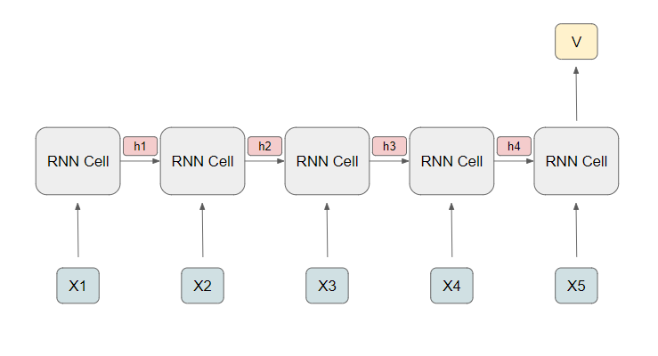
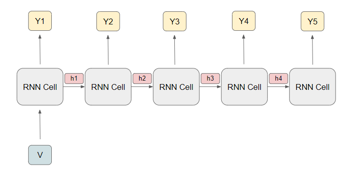

# Seq2Seq

## Index

1. Seq2Seq 개요
2. Preliminary
   1. RNN 구조
      1. Seq2Vec
      2. Vec2Seq
   2. GRU
3. Seq2Seq
4. 부록

## 1. Seq2Seq 개요

(그림 출처,  https://www.guru99.com/seq2seq-model.html )

 딥러닝 모델 중 Seq2Seq은 RNN의 한 구조이다. Sequence-to-Sequence라는 이름에 맞게 `순서가 있는 일련의 input`으로 부터 `순서가 있는 일련의 output`을 출력하는 구조이다. Seq2Seq이 사용되는 예시를 살펴보자.

1. 번역

   한국어를 영어로 번역한다고 하면, 한국어로 된 문장을 입력받아 뜻이 같은 영어를 출력하는 것이 목적이다. 이때 `한국어로 된 문장 = 순서가 있는 일련의 input`, `영어로 된 문장 = 순서가 있는 일련의 output`으로 생각하면 번역이 Seq2Seq 구조가 해결할 수 있는 문제라는 것을 알 수 있다. 

2. 내용 요약

   내용 요약도 비슷하게 해석할 수  있는데, `문서의 내용 = 순서가 있는 일련의 input`, `요약문 = 순서가 있는 일련의 output`으로 생각한다면 내용 요약도 Seq2Seq 구조가 해결할 수 있는 문제라는 것을 알 수 있다.

## 2. Preliminary

### 2. 1. RNN 구조

 Seq2Seq는 크게 encoder와 decoder로 구분된다. encoder를 이해하기 위해서 Seq2Vec, decoder를 이해하기 위해서 Vec2Seq 구조를 알고 가면 편하다.

#### 2.1.1. Seq2Vec(Encoder)

- Seq2Vec 구조는 `순서가 있는 일련의 input`의 정보를 파악하고 input들의 정보가 축약된 `하나의 output`을 출력한다.
- $h_t = f(h_{t-1}, x_t)$

#### 2.1.2. Vec2Seq(Decoder)

- Vec2Seq 구조는 `하나의 input`를 이용하여 `순서가 있는 일련의 output`을 출력한다.
- $h_t = f(h_{t-1}, Y_t)$
  - 여기서 $Y_t$는 예측값

##### teacher forcing

Vec2Seq에서는 teacher forcing이라는 개념이 있다. 잠시 살펴보자.

- No teacher forcing

- Teacher forcing

(그림 출처,  https://www.quora.com/What-is-the-teacher-forcing-in-RNN?awc=15748_1572237010_18c3421fa5fc54a37e4af9f73857da57&campaign=uad_mkt_en_acq_us_awin&medium=ad&pub_id=85386&set=awin&source=awin&txtv=8&uiv=6)

기존 Vec2Seq구조에서는 $h_t = f(h_{t-1}, Y_t)$에서 처럼 예측값 $Y_t$를 사용한다. 하지만 teacher forcing을 사용하게 된다면, 예측값 $Y_t$ 대신 $Y_{t-true}$를 사용한다.

teacher forcing을 사용하게 된다면 몇가지 장단점이 있다(출처  https://towardsdatascience.com/what-is-teacher-forcing-3da6217fed1c ).

- 장점

  - 수렴이 빠르다.

    훈련 초기에는 RNN의 예측값이 매우 좋지 않다. 따라서 초기에 안 좋은 예측을 한다면 depth가 깊어질 수록 error가 축적되어 모델이 이를 기반으로 다음을 예측하기 어렵게 된다.

- 단점

  - 예측 단계에서 문제가 될 수 있다.

    기본적으로 teacher forcing은 모델이 예측 단계에서 하는 추론 방식과 다르다(훈련과정에서는 $Y_{t-true}$를 사용하지만, 예측을 할 때는 $Y_{t-true}$의 개념이 없고, $Y_{t-1}$을 사용해야한다). 따라서 이는 모델의 성능을 저하시킬 수 있고, 모델 자체가 불안정하게 만들 수 있다.

### 2.2. GRU

(그림 출처,  https://medium.com/@saurabh.rathor092/simple-rnn-vs-gru-vs-lstm-difference-lies-in-more-flexible-control-5f33e07b1e57 )

 https://arxiv.org/abs/1406.1078 이 논문에서 저자들은 GRU 구조를 사용하는데 이왕 구조가 언급되었으니 집고 넘어가보자.

일단 수식을 보면 다음과 같다.

- $r_t = \sigma(W_{xr} \cdot x_t + W_{hr} \cdot h_{t-1} + b_r)$
- $z_t = \sigma(W_{xz}\cdot x_t + W_{hz}\cdot h_{t-1} + b_z)$
- $g_t = tanh(W_{xg}\cdot x_t + W_{hg} \cdot (r_t \times h_{t-1}) + b_g)$
- $h_t = z_t \times h_{t-1} + (1 - z_t) \times g_t$

수식을 차근차근 살펴보면 다음과 같이 해석할 수 있다.

- $h_t$는 셀의 출력값이다. 이는 $h_{t-1}$과 $g_t$로 결정되고 $z_t$가 $h_{t-1}$과 $g_t$의 비율을 결정한다. $z_t$ 값이 높을 수록 $h_{t-1}$, 즉 전기의 출력값이 현재 결과값에 많이 반영되고 $z_t$ 값이 낮다면 전기의 출력값이 현재 결과값에 적게 반영된다.

- $g_t$를 살펴보면 $x_t$와 $r_t$에 의해 줄어든 $h_{t-1}$에 의해 결정된다. $h_t$ 식에서 $h_{t-1}$을 전기에 관련된 항이라고 해석한다면, $g_t$는 현재 상태를 반영한다고 생각할 수 있다.

- 정리하자면 GRU Cell은 $x_t$와 $h_{t-1}$을 이용해 $r_t$와 $z_t$를 결정한다. 여기서 $r_t$는 현재 상태를 표현하는 $g_t$를 구할 때, $h_{t-1}$을 얼마나 반영할 지를 결정한다.

  출력값인 $h_t$는 앞서 구한 $z_t$를 통해 과거 기억($h_{t-1}$)을 얼마나 반영할 지 현재 상태($g_t$)를 얼마나 반영할 지 결정한다.

## 3. Seq2Seq

Preliminary에 있는 개념을 파악하면 Seq2Seq를 어렵지 않게 이해할 수 있다. 앞서 말한 것처럼 Seq2Seq는 encoder와 decoder로 구분되는 두가지 구조를 가지고 있다. encoder은 Seq2Vec과 비슷한 구조, decoder은 Vec2Seq과 비슷한 구조다. 그림을 다시 본다면 다음과 같다. 

예측 단계를 먼저 살펴보면, Encoder에서 `순서가 있는 일련의 input`을 `S`라는 하나의 벡터로 축약한다. 이 벡터를 Decoder에서 시작을 알리는 벡터를 `input`으로 넣고 RNN의 초기 상태를 `S`로 하여, `순서가 있는 일련의 output`을 출력한다.

훈련 단계에서는 Encoder는 변하지 않고, Decoder에서 예측 단계와는 다르게 teacher forcing을 사용한다.

훈련 단계에서 각각의 output의 softmax와 label를 이용하여 cross entropy를 구해 loss를 정의하고 backpropagation을 통해 가중치를 업데이트한다.

참고: 번역의 경우 BLEU score을 통해 모델의 성능을 평가한다.

## 4. BLEU

BLEU 내용 업데이트하기