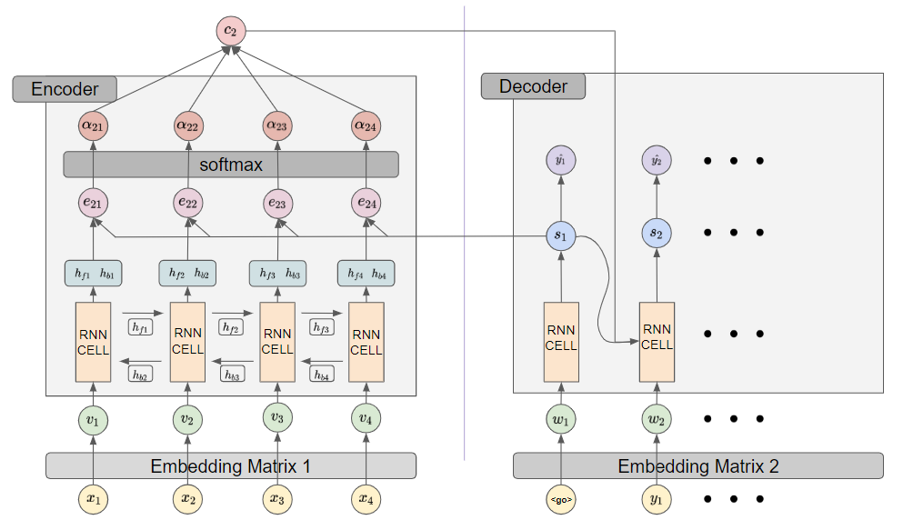
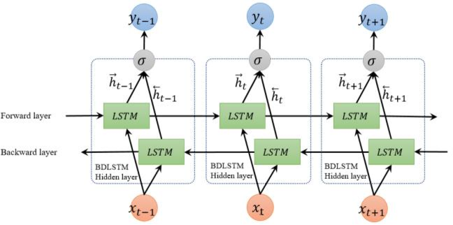

# Attention

## Index

1. Attention 개요
2. Attention
3. BiLSTM
   1. BiRNN
   2. LSTM

## Attention 개요

 Attention을 이해하기 위해서는 seq2seq 구조의 한계를 이해해야 한다. 해결해야하는 문제가 한국어에서 영어로 번역하는 것이라 하면, seq2seq의 encoder는 한국어 한 문장을 보고 하나의 context vector 문장을 함축한다. decoder는 context vector, 전 스탭의 hidden state, 그리고 전 스탭의 정답 데이터를 통해 답을 유추한다.

 Attention이 바라보는 seq2seq의 문제점은 decoder에서 context vector를 참조할 때, 매 스텝 똑같은 context vector를 참조한다는 것이다. decoder의 특정 위치에서는 input sentence의 특정한 부분이 중요하게 참조될 수도 있지만 seq2seq은 이를 반영하지 못한다. 한 문장의 길이가 길어질 수록 이러한 현상은 두드러지게 발생하며 이는 seq2seq 구조의 한계점이다. Attention은 이러한 문제를 해결할 수 있는 방법을 제시한다.

## Attention

 Attention은 seq2seq 문제를 해결하기 위해 decoder의 매 스탭마다 input 문장을 참조한다. 자세한 설명을 위해 기호를 먼저 정리하면 다음과 같다.

- $s_i$: decoder의 $i$번째 RNN Cell의 hidden state

- $h_j$: encoder의 $j$번째 RNN Cell의 hidden state

- $c_i$: $s_i$를 구하기 위해 참조한 input sentence를 참조하고 축약한 정보를 담고 있는 context vector

- $e_{ij}$: $c_i$를 구하기 위해 $h_j$와 $s_i$를 참조해 구한 attention score

  - attention scoring function은 다양하다.

    - Content-base attention

      $score(s_t, h_i) = cosine[s_t, h_i]$

    - Additive

      $score(s_t, h_i) = v_a^T tanh(W_a[s_t;h_i])$

    - Location-Base

      $score(s_t, h_i)=softmax(W_a s_t)$

    - General

      $score(s_t, h_i) = s_t^T W_a h_i$

    - Dot-Product

      $score(s_t, h_i) = s_t \cdot h_i$

    - where $W_a$ is a trainable weight matrix in teh attention layer.

이를 통해 decoder에서 일어나는 일을 수식으로 쓰면 다음과 같다. 

- $s_i = f(s_{i-1}, y_{i-1}, c_i)$
- 여기서 $c_i$는 다음과 같이 구한다.
- $c_i = \sum_{j=1}^{T_x}\alpha_{ij}h_j \text{, where } T_x \text{ is the number of the input sentence's words.}$
  - 여기서 $\alpha_{ij}$는 다음과 같이 구한다.
  - $\alpha_{ij} = \frac{exp(e_{ij})}{\sum_{k=1}^{T_x}exp(e_{ik})} \text{, where } e_{ij}=score(s_{i-1}, h_j).$ 

위에 수식을 통해 decoder는 매 스탭 $s_i$를 구할 때 input sentence를 한번씩 참조하게 되고 특정 스탭에 input sentence의 어떠한 부분이 현 스탭에서 중요한지 파악할 수 있게 된다.

## BiLSTM

Attention 개념이 처음나온 [이 논문](https://arxiv.org/abs/1409.0473)에서 encoder 부분에 BiLSTM을 사용한다. BiLSTM이 언급된 김에 정리하고 넘어가자.

### BiRNN

기존 RNN이 앞에서부터 뒤로 hidden state를 넘긴다면 BiRNN은 뒤에서부터 앞으로도 hidden state를 넘기게 된다. 위에 그림에서는 정방향(?)을 $h_{fi}$ 역방향(?)을 $h_{bj}$으로 표현한다. BiRNN에서 스탭 수가 $T_x$라면 필요한 RNN CELL의 개수는 $2 \times T_x$가 된다.

### LSTM

 [그림 출처, https://en.wikipedia.org/wiki/Long_short-term_memory]

RNN은 뒤로 갈수록 초기 정보가 손실되는 단점이 있다. 이를 보안할 수 있는 모델로서 제안된 것이 LSTM 모델이다. LSTM은 은닉층의 메모리 셀에 입력 게이트, 망각 게이트, 출력 게이트를 추가하여 불필요한 기억을 지우고, 기억해야할 기억을 유지한다.

  - 입력 게이트
    - $i_t = \sigma(W_{x_i}x_t + W_{h_i}h_{t-1} + b_i)$
    - $g_t = tanh(W_{x_g}{x_t} + W_{h_g}h_{t-1} + b_g)$
    - $i_t$는 현재 기억($g_t$)을 장기기억으로서 얼마나 가지고 갈지(0과 1사이의 값)
  - 삭제 게이트
    - $f_t = \sigma(W_{x_f}x_t + W_{h_f}h_{t-1} + b_f)$
    - 전 스탭의 장기기억을 장기기억으로서 얼마나 가지고 갈지(0과 1사이의 값)
  - 셀 상태(장기 상태)
    - $C_{t} = f_t \cdot C_{t-1} + i_t \cdot g_t$
  - 출력 게이트와 은닉 상태(단기 상태)
    - $o_t = \sigma(W_{x_o}x_t + W_{h_o}h_{t-1} + b_o)$
    - $h_t = o_t \cdot tanh(C_t)$
    - $o_t$는 현재기억이 반영된 장기기억을 어느 정도 출력할지 결정(0과 1사이의 값)
