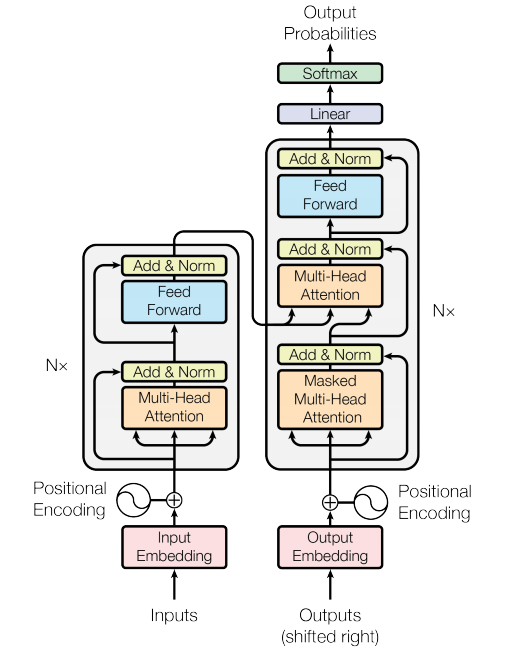
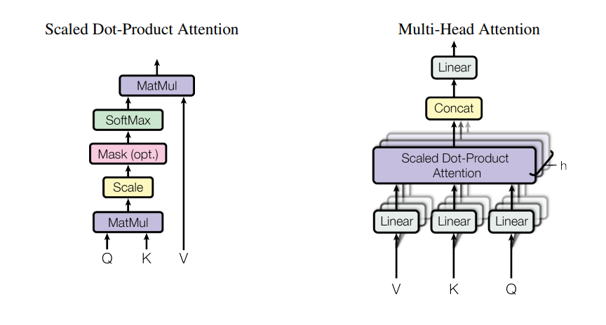

# Transformer

## Index

1. Introduction of Transformer
2. Preliminary
   1. Self-Attention
   2. Residual Connction
   3. Batch Normalization and Layer Normalization
3. Transformer
   1. Encoder and Decoder Stacks
   2. Attention
      1. Scaled Dot-Product Attention
      2. Multi-Head Attention
      3. Applications of Attention in Transformer
   3. Position-wise Feed-Forward Networks
   4. Embeddings and Softmax
   5. Positional Embedding
4. Summary

## Introduction of the Transformer

Transformer 이전의 sequece transduction model들은 encoder와 decoder를 사용한 RNN 기반의 구조로 이루어져 있다. 이 RNN을 기반으로 한 구조의 RNN layer는 순차적으로 정보를 읽는다. 하지만 이 순차적이라는 것은 input의 길이가 길면 문제가 된다. 

```
The word 'scapegoat' comes from an ancient Jewish tradition about a goat. When a Jew wanted to be forgotten for his sins, he had to bring to two goats to a high priest. One goat was sacrificed to God. The priest then laid his hand in the other goat and recited the person's sins. This goat was called a scapegoat. It was sent into the wilderness. The Jew believed it carried the sins away with it.
```

위와 같은 문장이 있을 때, 마지막 문장의 it이 의미하는 바를 RNN 구조가 제대로 해석하기 어렵다. 그 이유는 it이 의미하는 goat는 세 문장 전에 나왔고, 세 문장안에는 it의 의미로 헷갈릴 만한 명사들이 많이 등장하기 때문이다. RNN이 이를 순차적으로 본다면 goat는 LSTM이나 GRU Cell에서 서서히 잊혀질 것이다.

이를 해결하기 위해  Transformer은 기존 sequence transduction model에서 RNN 구조를 사용하지 않는다. 그리고 encoder에서 긴 input의 각각의 단어가 input의 어떤 단어와 연관성이 높은지 scoring을 하고(Self-Attention Scoring) 이를 decoder의 input에 추가한다. 이 기존과 다른 구조는 RNN을 사용하지 않음으로써 속도를 얻고, encoder와 decoder의 Self-Attention을 통해  정확도를 얻었다.

## Preliminary

### Self-Attention


Self-Attention은 문장에서 각 단어끼리 얼마나 관계가 있는지를 계산해서 반영하는 방법이다. self-Attention에서 $x_1$의 출력값인 $c_1$을 어떻게 얻을 수 있는지 알아보자.

1.  $x_1, x_2, x_3, x_4$는 embedding matrix를 통해 $v_1, v_2, v_3, v_4$으로 변환된다.
2. $e_{1j} = Attention(v_1, v_j)$
   - $e_{ij}$: $v_i$와 $v_j$의 상관 관계의 크기 
3. $(\alpha_{11}, \alpha_{12}, \alpha_{13}, \alpha_{14}) = softmax((e_{11}, e_{12}, e_{13}, e_{14}))$
4. $c_1 = \sum^4_{j=1}\alpha_{1j}v_j$
   - $\alpha_{ij}의 크기가 클 수록 c_i는 v_j와 비슷해진다.$

이렇게 구한 $c_1$을 $x_1$에 대한 context vector라고 한다. context vector $c_1$은 $x_1$의 문장에 대한 관계를 수치화한 값이다. 이 과정을 $x_2, x_3, x_4$에 대해 반복하면 $(c_1, c_2, c_3, c_4)$를 얻을 수 있다.

### Residual Connection

[Deep residual learning for image recognition]( https://arxiv.org/pdf/1512.03385.pdf )


Residual connection이 보는 깊은 딥러닝의 문제는 다음과 같다. 만약 신경망의 깊이가 3이 가장 적절하다고 가정하자. 이 신경망에 3 이상으로 layer들이 더 추가된다면 이 layer들은 identity mapping이면 충분하다. 하지만 모델들은 identity mapping을 잘 만들지 못한다(*불확실한 정보*). 따라서 특정 깊이 이상으로 layer을 추가적으로 늘린다면 오히려 loss가 늘어나게 된다.

Residual connection은 이 문제를 해결하는 방법은 layer의 input이 현재 상태에 비해 얼마나 변해야 되는지를 layer가 훈련하는 것이다. 즉, 우리가 원하는 결과가 $H(x)$라면 layer가 추론하는 값은 $H(x) - x$가 된다. 이 추론값을 $F(x)$라고 한다면, 이 layer에 추가로 $+x$를 해주는 layer을 추가한다면 $F(x)$는 $x$가 변화하는 정도를 학습하면 된다.

만약 구해야하는 $H(x)$의 이상적 mapping이 identity mapping이라면 $F(x)$가 추론해야 하는 것은 zero mapping이다. zero mapping은 solver가 학습하기 더 쉽기에(*불확실한 정보*) 필요없는 layer라면 zero mapping으로 잘 수렴될 것이다. 논문 저자들의 실험적결과로 learned residual functions는 small response를 가지고 있었다.

이 논문에는 나오지 않지만 추가적으로 gradient 소실 문제와 폭발 문제를 해결해주기도 한다고 한다(출처, paper, Residual Recurrent Neural Networks for Learning Sequential Representations).

### Batch Normalization and Layer Normalization

[layer normalization](https://arxiv.org/pdf/1607.06450.pdf)

#### Batch Normalization

**Batch Normalization**은 훈련하는 동안 이전 층의 파라미터가 변함에 따라 각 층에 들어오는 입력의 분포가 변화되는 문제를 해결하고자 나온 개념이다. 이 기법은 각 층에서 활성화 함수를 통과하기 전에 모델에 연산을 하나 추가하는데, 단순하게 입력 데이터의 평균을 0으로 만들고 정규화한 다음, 각 층에서 두 개의 새로운 파라미터로 결과값의 스케일을 조정하고 이동시킨다(하나는 스케일 조정을 위해, 다른 하나는 이동을 위해 필요). 이로 인해 모델이 층마다 입력 데이터의 최적 스케일과 평균을 학습한다.

#### Layer Normalization

Batch normalization의 단점은 1. mini-batch size에 의존하고 2. dynamic RNN에는 어떻게 적용되야 할지 모호하다는 것이다. 이를 해결하기 위해 나온 개념이 **Layer Normalization**이다. 이와 달리 Layer normalization은 훈련 때와 추론 때 모두 같은 계산을 한다. 또 각 time step의 RNN Cell에 적용하는데 강점이 있다.

#### Batch Normalization vs Layer Normalization

- $H_l := \begin{bmatrix} h_{11} & h_{12} & h_{13} & h_{14} \\ h_{21} & h_{22} & h_{23} & h_{24} \\ h_{31} & h_{32} & h_{33} & h_{34} \end{bmatrix}$
- $H_l$: $l$번째 hidden layer의 출력 matrix
- $row(H_l)$: n of input
- $column(H_l)$: n of the hidden units of $H_l$

##### Batch Normalization

- $\mu_l = (\frac{1}{3}\sum^3_{i=1}h_{i1}, \frac{1}{3}\sum^3_{i=1}h_{i2}, \frac{1}{3}\sum^3_{i=1}h_{i3}, \frac{1}{3}\sum^3_{i=1}h_{i4})$
- $\sigma^2_l = (\frac{1}{3}\sum^3_{i=1}(h_{i1}-\mu_l[1])^2, \frac{1}{3}\sum^3_{i=1}(h_{i2}-\mu_l[2])^2, \frac{1}{3}\sum^3_{i=3}(h_{i3}-\mu_l[3])^2, \frac{1}{3}\sum^3_{i=1}(h_{i4}-\mu_l[4])^2)$
- $\hat{h_ij} = \frac{h_ij - \mu_l}{\sqrt{\sigma^2_l + \epsilon}}$

##### Layer Normalization

- $\mu_l = (\frac{1}{4}\sum^4_{j=1}h_{1j}, \frac{1}{4}\sum^4_{j=1}h_{2j}, \frac{1}{4}\sum^4_{j=1}h_{3j})$
- $\sigma^2_l = (\frac{1}{4}\sum^4_{j=1}(h_{1j}-\mu_l[1])^2, \frac{1}{4}\sum^4_{j=1}(h_{2j}-\mu_l[2])^2, \frac{1}{4}\sum^4_{j=3}(h_{3j}-\mu_l[3])^2$
- $\hat{h_ij} = \frac{h_ij - \mu_l}{\sqrt{\sigma^2_l + \epsilon}}$

## Transformer




그림출처(https://machinereads.com/2018/09/26/attention-is-all-you-need/)

많은 sequence transduction model은 encoder-decoder structure를 가지고 있다. encoder는 input sequence $(x_1, x_2, \cdots, x_n)$을 연속적인 값을 가진 $z = (z_1, \cdots, z_n)$로 바꾼다. 주어진 $z$에 대해, decoder는 output sequence $(y_1, y_2, \cdots, y_m)$을 출력한다.

Transformer는 이런 self-attention과 point-wise, fully connected layer를 이용하여 encoder, decoder 구조를 따른다.

### Encoder and Decoder Stacks

**Encoder**: encoder는 N개의(논문에서는 N=6) 똑같은 layer로 구성되어 있다. 각 layer는 두가지 sub-layer를 가지고 있다. 첫번째는 multi-head self-attention이고 두번째는 position-wise fully connected feed-forward network이다. 또 residual connection과 layer normalization을 두 sub-layer에 각각 적용했다. 결과적으로 한 layer을 지나 출력된 결과는 $LayerNorm(x + Sublayer(x))$이다. residual connection을 적용의 편의를 위하여 모든 sub-layers 혹은 embedding layer도 dimension을  $d_{model}$로 일정하게 한다(논문에서는 $d_{model}=512$).

**Decoder**: decoder도 마찬가지고 N개의(논문에서는 N=6) 똑같은 layer로 구성되어 있다. encoder의 두개의 sub-layer에 추가로 세번째 sub-layer를 사이에 추가한다. 이 sub-layer는 encoder stack의 출력값 위에 multi-head attention을 적용한다. encoder와 마찬가지로 residual connection과 layer normalization을 적용한다. self-attention sub-layer는 $y_i$를 예측할 때, 뒤쪽 단어를 보고 예측하지 않을 수 있도록 막는다. 이런 masking은 예측할 때, $i$보다 전에 예측한 출력을 보고 $y_i$를 예측할 수 있도록 유도한다.

### Attention

transformer에서는 Sacled Dot-Product Attention과 Multi-Head Attention을 사용한다.



#### Scaled Dot-Product Attention


Attention에 들어오는 query와 key의 dimension을 $d_k$, value의 dimension을 $d_v$라고 하자. 이 Scaled Dot-Product의 Attention Score는 $AttentionScore(query, key) = \frac{query \cdot key}{\sqrt{d_k}}$이다. 대표적인 Attention-Score 함수는 additive attention과 dot-product attention이 있다. 두 attention score함수는 이론상 complexity는 같지만 dot-product attention이 matrix multiplication이 되기 때문에 더 빠르다.

$d_k$가 작은 경우에는 두 attention이 비슷하지만, $d_k$가 크다면, additive attention이 dot product attention보다 성능이 좋다. $d_k$가 크다면, dot product의 크기는 매우 커지고, 그렇다면 softmax 함수의 출력값이 매우 작아지게 된다. 이를 상쇄하기 위해서 논문에서는 $\sqrt{d_k}$로 dot product를 나눠주었다.

식으로 보면 다음과 같다.

- $Attention(Q, K, V) = softmax(\frac{QK^T}{\sqrt{d_k}})V$

#### Multi-Head Attention

$d_{model}$ 차원을 가진 keys, values, queries보다 keys, values, queries를 $d_k, d_k, d_v$차원으로 projection을 하는 것이 더 좋다. 이 각각의 projection된 keys, values, queries에 대해 attention을 적용하고 $d_v$-dimensional vector를 출력한다. 추가로 이 과정을 h번 반복하여 각각의 output을 concate하여 다시 projection한다.

이 Multi-head attention은 각각 다른 위치와 다른 표현의 정보를 함축할 수 있다. Multi-head attention의 수식은 다음과 같다.

- $MultiHead(Q, K, V) = Concat(head_1, \cdots, head_h)W^O \text{ where } head_i = Attention(QW^Q_i, KW^K_i, VW^V_i)$
- Where the projections are parameter matrices $W^Q_i \in \mathbb{R}^{d_{model} \times d_k}, W^K_i \in \mathbb{R}^{d_{model} \times d_k}, W^V_i \in \mathbb{R}^{d_{model} \times d_v}$ and $W^O \in \mathbb{R}^{hd_v \times d_{model}}$

논문에서는 $h = 8, d_k = d_v = d_{model}/h = 64$로 설정했다. 각각의 head의 dimension의 개수를 낮춰서 종합적인 계산량은 single-head attention과 비슷하다.

#### Applications of Attention in Transformer

Transformer는 세가지 방향으로 multi-head attention을 사용한다.

- "encoder-decoder attention" layer에서 query는 previous decoder layer에서 오며 keys and values는 input sequence에서 참조한다. 이 덕분에 decoder는 input sequence의 모든 위치를 참조할 수 있다.
- encoder의 self-attention layer의 key, value, query는 모두 전 layer의 출력에서 참조한다. 각각의 위치의 데이터는 모든 위치를 참조한다.
- decoder의 self-attention layer는 현재 위치와 현재 위치보다 전에 있는 것만 참조한다. test 단계에서는 뒤를 참조할 수 없기 때문이다.

### Position-wise Feed-Forward Networks

attention sub-layer의 추가로 fully connected feed-forward network를 연결한다. 이 network는 두 개의 linear transformation로 이루어져있다.

- $FFN(x) = max(0, xW_1 + b_1)W_2 + b_2$
- $W_1$은 $(d_{model}, d_{ff})$의 크기를 가지고 $W_2$는 $(d_{ff}, d_{model})$ 크기를 가지고 있다.

### Embeddings and Softmax

다른 sequence transduction model처럼 transformer는 embedding matrix를 input token과 output token을 vector로 바꾸는데 사용한다. 또 linear transformation과 softmax function을 이용해서 decoder output을 next-token probabilities로 바꾼다. transformer에서 두 embedding layer와 softmax 전에 linear transformation에 같은 weight matrix를 사용한다(embedding layer: ($VocabSize$, $d_{model}$), linear transformation: ($d_{model}$, $VocabSize$))

Q. 그러면 input 토큰과 output 토큰을 같은 공간에 embedding하는 건가?

Jeff님은 안나눴음( https://github.com/graykode/nlp-tutorial/tree/master/5-1.Transformer )

### Positional Encoding

Transformer는 RNN이나 CNN을 사용하지 않아서 순서에 대한 정보를 따로 저장해주어야한다. 이를 위해 Transformer는 "positional encodings"를 embedding vector에 더한다. Transformer에서는 positional encoding을 위해 sin 함수와 cos 함수를 이용한다.

- $PE_{(pos, 2i)} = sin(pos/10000^{(2i/d_{model})})$
- $PE_{(pos, 2i+1)} = cos(pos/10000^{(2i/d_{model})})$
- where $pos$ is the position and $i$ is the dimension (of the embedding vector).

## Summary


1. input sequence는 embedding되고 positional encoding을 통해 위치정보를 함께 가지고 있는 벡터로 변환된다.
2. encoder에서 Multi-Head Self-Attention layer를 만나 context vector를 출력하고 residual connection과 layer normalization layer를 지나게 된다.
3. Feed-Forward layer에서 linear transformation과 relu activation function을 지나고 residual connection과 layer normalization layer를 지난다.
4. 2-3번을 N회 반복하고 encoder output을 생성한다.
5. output sequence는 embedding되고 positional encoding을 통해 위치정보를 함께 가지고 있는 벡터로 변환된다.
6. decoder에서 Masked Multi-Head Self-Attention layer를 만나 context vector를 출력하고 residual connection과 layer normalization layer를 지나게 된다.
7. 전 sublayer output과 encoder output을 input으로 받는 multi-head attention layer를 지나 residual connection과 layer normalization layer를 지난다.
8. Feed-Forward layer에서 linear transformation과 relu activation function을 지나고 residual connection과 layer normalization layer를 지난다.
9. 6-7번을 N회 반복하고 decoder output을 생성한다.
10. decoder output은 linear transformation(transpose of embedding matrix)을 지나고 softmax 함수를 지나 $\hat{z}$(output sequence의 예측값)을 출력한다.
11. loss 함수와 optimizer를 통해 가중치들을 업데이트한다.
12. 1-11을 epoch만큼 반복한다.