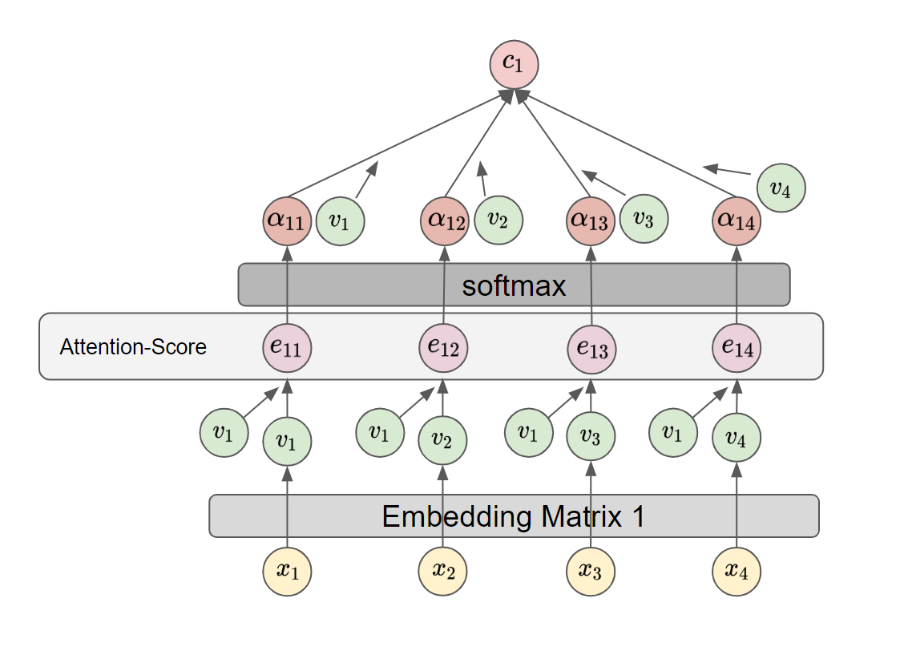

# Transformer

## Index

1. Introduction of Transformer
2. Preliminary
   1. Self-Attention
   2. Residual Connction
   3. Batch Normalization and Layer Normalization
3. Transformer
   1. Positional Embedding
   2. Scaled Dot-Product Attention
   3. Multi Head Self-Attention
   4. Transformer

## Introduction of the Transformer

Transformer 이전의 sequece transduction model들은 encoder와 decoder를 사용한 RNN 기반의 구조로 이루어져 있다. 이 RNN을 기반으로 한 구조의 RNN layer는 순차적으로 정보를 읽는다. 하지만 이 순차적이라는 것은 input의 길이가 길면 문제가 된다. 

```
The word 'scapegoat' comes from an ancient Jewish tradition about a goat. When a Jew wanted to be forgotten for his sins, he had to bring to two goats to a high priest. One goat was sacrificed to God. The priest then laid his hand in the other goat and recited the person's sins. This goat was called a scapegoat. It was sent into the wilderness. The Jew believed it carried the sins away with it.
```

위와 같은 문장이 있을 때, 마지막 문장의 it이 의미하는 바를 RNN 구조가 제대로 해석할 수 있을지 생각하면 어려울 것이라 생각된다. 그 이유는 it이 의미하는 goat는 세 문장 전에 나왔고, 세 문장안에는 it의 의미로 헷갈릴 만한 명사들이 많이 등장한다. RNN이 이를 순차적으로 본다면 아마 goat는 LSTM과 GRU Cell에서 서서히 잊혀질 것이다.

이를 해결하기 위해  Transformer은 기존 sequence transduction model에서 RNN 구조를 버린다. 그리고 encoder에서 긴 input의 각각의 단어가 input의 어떤 단어와 연관성이 높은지 scoring을 하고(Attention Scoring) 이를 decoder에 추가적으로 input에 추가한다. 이 기존과 다른 구조는 RNN 구조를 버림으로서 속도를 얻고, encoder와 decoder의 Attention을 통해  정확도를 얻었다.

## Preliminary

### Self-Attention



Self-Attention은 문장에서 각 단어끼리 얼마나 관계가 있는지를 계산해서 반영하는 방법이다. $x_1$의 self-Attention의 출력값인 $c_1$을 어떻게 얻을 수 있는지 알아보자.

1.  $x_1, x_2, x_3, x_4$는 embedding matrix를 통해 $v_1, v_2, v_3, v_4$으로 변환된다.
2. $e_{1j} = Attention(v_1, v_j)$
   - $e_{ij}$: $v_i$와 $v_j$의 상관 관계의 크기 
3. $(\alpha_{11}, \alpha_{12}, \alpha_{13}, \alpha_{14}) = softmax((e_{11}, e_{12}, e_{13}, e_{14}))$
4. $c_1 = \sum^4_{j=1}\alpha_{1j}v_j$
   - $\alpha_{ij}의 크기가 클 수록 c_i는 v_j와 비슷해진다.$

이렇게 구한 $c_1$을 $x_1$에 대한 context vector라고 한다. context vector $c_1$은 $x_1$의 문장에 대한 관계를 수치화한 값이다. 이 과정을 $x_2, x_3, x_4$에 대해 반복하면 $(c_1, c_2, c_3, c_4)$를 얻을 수 있다.

### Residual Connection


Residual connection이 보는 깊은 딥러닝의 문제는 다음과 같다. 만약 신경망의 깊이가 3이 가장 적절하다고 가정하자. 이 신경망에 필요 이상으로 layer들이 더 추가된다면 이 layer들은 identity mapping이면 충분하다. 하지만 모델들은 identity mapping을 잘 만들지 못한다(불확실한 정보). 따라서 특정 깊이 이상으로 layer을 추가적으로 늘린다면 오히려 loss가 늘어나게 된다.

Residual connection은 이 문제를 해결하는 방법은 layer의 input이 현재 상태에 비해 얼마나 변해야 되는지를 layer가 훈련하는 것이다. 즉, 우리가 원하는 결과가 $H(x)$라면 layer가 추론하는 값은 $H(x) - x$가 된다. 이 추론값을 $F(x)$라고 한다면, 이 layer에 추가로 $+x$를 해주는 layer을 추가한다면 $F(x)$는 $x$가 변화하는 정도를 학습하면 된다.

만약 구해야하는 $H(x)$의 이상적 mapping이 identity mapping이라면 $F(x)$가 추론해야 하는 것은 zero mapping이다. zero mapping은 solver가 학습하기 더 쉽기에(불확실한 정보) 필요없는 layer라면 zero mapping으로 잘 수렴될 것이다. 실험적으로 learned residual functions는 small response를 가지고 있다.

[Deep residual learning for image recognition]( https://arxiv.org/pdf/1512.03385.pdf )이 논문에는 나오지 않지만 추가적으로 gradient 소실 문제와 폭발 문제를 해결해주기도 한다고 한다(출처, paper, Residual Recurrent Neural Networks for Learning Sequential Representations).

### Batch Normalization and Layer Normalization

내용 출처: [layer normalization](https://arxiv.org/pdf/1607.06450.pdf)

#### Batch Normalization

**Batch Normalization**은 훈련하는 동안 이전 층의 파라미터가 변함에 따라 각 층에 들어오는 입력의 분포가 변화되는 문제를 해결하고자 나온 개념이다. 이 기법은 각 층에서 활성화 함수를 통과하기 전에 모델에 연산을 하나 추가하는데, 단순하게 입력 데이터의 평균을 0으로 만들고 정규화한 다음, 각 층에서 두 개의 새로운 파라미터로 결과값의 스케일을 조정하고 이동시킨다(하나는 스케일 조정을 위해, 다른 하나는 이동을 위해 필요). 이로 인해 모델이 층마다 입력 데이터의 최적 스케일과 평균을 학습한다.

#### Layer Normalization

Batch normalization의 단점은 1. mini-batch size에 의존하고 2. dynamic RNN에는 어떻게 적용되야 할지 모호하다는 것이다. 이를 해결하기 위해 나온 개념이 **Layer Normalization**이다. 이와 달리 Layer normalization은 훈련 때와 추론 때 모두 같은 계산을 한다. 또 각 time step의 RNN Cell에 적용하는데 강점이 있다.

#### Batch Normalization vs Layer Normalization

- $H_l := \begin{bmatrix} h_{11} & h_{12} & h_{13} & h_{14} \\ h_{21} & h_{22} & h_{23} & h_{24} \\ h_{31} & h_{32} & h_{33} & h_{34} \end{bmatrix}$
- $H_l$: $l$번째 hidden layer의 출력 matrix
- $row(H_l)$: n of input
- $column(H_l)$: n of the hidden units of $H_l$

##### Batch Normalization

- $\mu_l = (\frac{1}{3}\sum^3_{i=1}h_{i1}, \frac{1}{3}\sum^3_{i=1}h_{i2}, \frac{1}{3}\sum^3_{i=1}h_{i3}, \frac{1}{3}\sum^3_{i=1}h_{i4})$
- $\sigma^2_l = (\frac{1}{3}\sum^3_{i=1}(h_{i1}-\mu_l[1])^2, \frac{1}{3}\sum^3_{i=1}(h_{i2}-\mu_l[2])^2, \frac{1}{3}\sum^3_{i=3}(h_{i3}-\mu_l[3])^2, \frac{1}{3}\sum^3_{i=1}(h_{i4}-\mu_l[4])^2)$
- $\hat{h_ij} = \frac{h_ij - \mu_l}{\sqrt{\sigma^2_l + \epsilon}}$

##### Layer Normalization

- $\mu_l = (\frac{1}{4}\sum^4_{j=1}h_{1j}, \frac{1}{4}\sum^4_{j=1}h_{2j}, \frac{1}{4}\sum^4_{j=1}h_{3j})$
- $\sigma^2_l = (\frac{1}{4}\sum^4_{j=1}(h_{1j}-\mu_l[1])^2, \frac{1}{4}\sum^4_{j=1}(h_{2j}-\mu_l[2])^2, \frac{1}{4}\sum^4_{j=3}(h_{3j}-\mu_l[3])^2$
- $\hat{h_ij} = \frac{h_ij - \mu_l}{\sqrt{\sigma^2_l + \epsilon}}$


1. positional embedding(in paper)
2. Scaled Dot-Product Attention(in paper)
3. Multi head self attention(in paper)
   1. self attention?
   2. Multi head attention?
